# 공정 설비 데이터 분석 프로그램 사용 매뉴얼 (v3.1)

DCS/PI 등에서 내보낸 공정 시계열 데이터(CSV/Excel)를 올려서 증류탑·열교환기·반응기·공정단위를 분석하는 웹 대시보드입니다.
v3.1부터는 **장치와 관계없는 어떤 숫자 데이터든**(실험·시료 분석처럼 시간이 없는 데이터 포함) 상관·회귀·잔차 분석을 할 수 있습니다.

- **설비 KPI** (v2): 열교환기(전열량, U, 파울링 저항, 세정 시기), 반응기(WABT, 촉매 활성 저하, EOR 예측, 전환율·선택도·수율)
- **트렌드·통계**: 태그별 추이 그래프(겹쳐 보기 / 태그별 분리 / 정규화, 최대 20개), 기초통계, 상관계수 히트맵
- **상관분석** (v3.1): 변수 개수 제한 없는 상관 행렬(피어슨·스피어만·켄달·편상관), 곡선(비선형) 관계 자동 판별, 자기상관 보정 p값, **이변량 회귀**(6가지 모델, 신뢰·예측구간), **잔차 분석**(자기상관·등분산·정규성·영향점), **시차 상관·그랜저 선후 관계**, 다중공선성(VIF)
- **소프트센서**: 온도·압력·유량으로 제품 순도 같은 품질 변수를 예측하는 모델(OLS / PLS)
  - 최적 입력 지연 자동 탐색, 패리티 플롯, **DCS에 바로 옮길 수 있는 원래 단위 모델식**
- **모델 적용**: 저장해 둔 소프트센서 모델을 새 운전데이터에 다시 적용하고 정확도 확인
- **공정단위** (v2): 물질·에너지 수지, 원단위, 정상상태 구간 탐지, 다변량 이상감지(PCA), **변화점 탐지**(v3.1, 운전 모드 변화 시점)
- **ML 소프트센서** (v3): 랜덤포레스트·그래디언트 부스팅·신경망 모델, 자동 튜닝, 잔차 알람 (BibMon 라이브러리 활용)
- **예제·벤치마크 데이터** (v3): Tennessee Eastman 고장 21종·Petrobras 실제 공정 데이터(오프라인), CSTR·발전소 데이터(chelo, 인터넷)

설비 KPI에서 계산한 값(U, WABT 등)은 다른 모든 탭에서 일반 태그처럼 추세·통계·소프트센서·이상감지에 쓸 수 있습니다.

| 알고 싶은 것 | 볼 곳 |
|---|---|
| 화면 조작 방법 | 3 ~ 8장 (탭 순서대로: 설비 KPI → 트렌드·통계·**상관분석(5.4~5.8)** → 소프트센서 → 모델 적용 → 공정단위) |
| 장치와 상관없는 데이터의 상관·회귀 분석 | **5.4 상관분석 탭**, 기초 지식 10.27~10.35 |
| 운전 모드(압력·부하·개조 전후)가 섞인 데이터 | **5.9 운전 구간별 비교**, 10.35 |
| 시간 컬럼이 없는 데이터 (실험·시료·배치) | 2장 **시간이 없는 데이터** |
| 올린 운전데이터가 어디로 가는지, 보안 | **9장 데이터 보안** |
| 각 기능이 무엇이고 언제·어떻게 쓰면 좋은지 | **10장 기능별 기초 지식** |
| 오류가 날 때 | 11장 문제 해결 |
| 운전데이터 없이 기능을 먼저 써 보고 싶을 때 | 3장 **예제 데이터** |
| 버전별 변경 내용 | 부록 C |

---

## 1. 설치 및 실행

Python 3.10 이상이 필요합니다.

```bash
pip install -r requirements.txt
streamlit run app.py
```

실행하면 브라우저가 자동으로 열립니다. 열리지 않으면 주소창에 `http://localhost:8501` 을 입력하세요.
종료는 터미널에서 `Ctrl + C`.

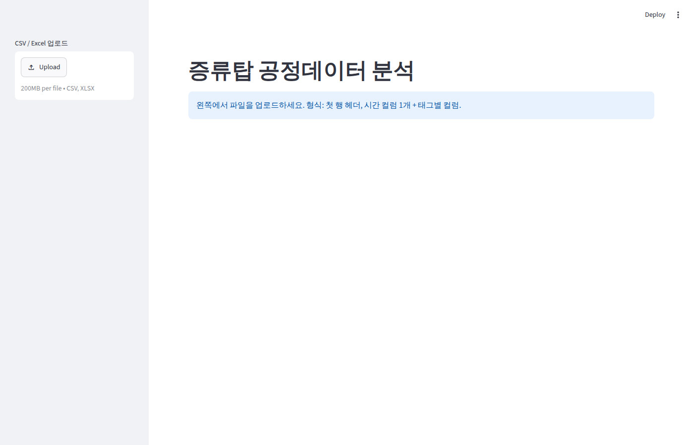

> 화면 테마: 오른쪽 위 `⋮` → Settings 에서 Light / Dark 를 바꿀 수 있습니다. 그래프 색도 테마에 맞춰 바뀝니다.

> v3부터 BibMon·chelo와 그 의존 패키지(scikit-learn, scipy, statsmodels, optuna 등)가 함께 설치되어 설치 용량이 약 300MB 늘었습니다. ML 모델과 Tennessee Eastman 데이터는 **처음 한 번** 불러올 때 몇 초 더 걸립니다.

> v3.1의 상관·회귀·잔차 분석은 v3에서 이미 함께 설치되던 **statsmodels·scipy** 를 쓰고, 변화점 탐지용 **ruptures**(약 1MB) 하나만 새로 설치됩니다.

> 기본 설정(`.streamlit/config.toml`)상 **이 PC에서만** 열 수 있습니다. 동료와 같이 쓰려면 9.3을 먼저 읽으세요.

---

## 2. 데이터 준비

### 파일 형식

- **CSV** (`.csv`) 또는 **Excel** (`.xlsx`, 첫 번째 시트)
- 첫 행은 헤더(컬럼 이름)
- 시간 컬럼 1개 + 태그별 컬럼

```
시간,원료유량,환류유량,탑정온도,탑저온도,탑압력,제품순도
2026-09-01 00:00,50.02,30.11,78.05,110.1,1.201,99.02
2026-09-01 00:01,50.05,29.87,78.10,110.0,1.198,
2026-09-01 00:02,50.01,30.02,Bad,110.2,1.203,
...
```

### 자동으로 처리되는 것

| 상황 | 처리 |
|---|---|
| 한글 CSV 인코딩 (UTF-8 / CP949·EUC-KR) | 자동 인식 |
| `Bad`, `I/O Timeout`, `Shutdown` 등 숫자가 아닌 값 | 빈 값(결측)으로 처리 |
| 시간 형식이 행마다 다름 (예: 일부 행만 `00:00:01.5` 처럼 소수 초) | 행별로 해석 |
| 서머타임 전환 등으로 시간대(+01:00/+02:00)가 섞여 있음 | UTC 기준으로 통일 |
| 시간으로 해석할 수 없는 행 | 제외 (단, 10% 넘게 해석이 안 되면 시간 컬럼이 아닌 것으로 판단) |
| 시간 순서가 섞여 있음 | 시간순 정렬 |
| **상태 컬럼** (`Yes`/`No`, `On`/`Off`, `True`/`False`, `Run`/`Stop`, `Open`/`Close`, `가동`/`정지`, `운전`/`정지`, `예`/`아니오`, `사용`/`미사용` 등 두 상태, 대소문자·앞뒤 공백 무관) | **1/0으로 바꿔 분석에 포함** (v3.1). 이름에 어느 값이 1인지 붙습니다 (예: `Preheating [Yes=1 · No=0]`). 사이드바에 "상태 컬럼을 1/0으로 바꿔 분석에 포함" 으로 표시 |
| 숫자가 하나도 없는 컬럼 (설명, 단위, `A`/`B` 같은 임의 라벨 등) | 제외하고 사이드바에 **"숫자 값이 없어 분석에서 제외한 컬럼"** 으로 이름 표시 (v3.1). 임의 라벨은 어느 쪽이 1인지 정할 수 없어 바꾸지 않습니다 |
| 기록이 한동안 없는 기간 (정기보수·정지·내보내기 누락) | 평소 간격의 5배보다 긴 공백은 그래프에서 **선을 끊어** 표시 (공백을 직선으로 잇지 않음, v3.1) |
| 시간 컬럼 외의 다른 날짜 컬럼 (예: 분석 시료 채취 시각) | 태그 목록에서 제외 |
| 분석 값(Lab/GC)처럼 드문드문 있는 품질 변수 | 값이 있는 시점만 모델 학습에 사용 |

### 시간이 없는 데이터 (v3.1)

실험 결과, 시료 분석표, 배치 기록처럼 **시각이 없는** 데이터도 분석할 수 있습니다.

```
시료번호,촉매량,반응온도,수율
1,4.66,169.3,92.2
2,3.43,241.7,95.2
...
```

| 사이드바 **시간 컬럼** 선택 | 동작 |
|---|---|
| **(없음 · 행 순서대로)** | 파일의 행 순서 그대로 분석. 모든 숫자 컬럼이 태그가 됩니다 |
| 숫자로 된 순서 컬럼 (예: `시료번호`, `배치번호`) | "순서 번호로 사용합니다" 안내와 함께 그 번호순으로 정렬하고, 그 컬럼은 태그에서 뺍니다 |

- 모든 탭이 동작하도록 **가상 시각**을 붙입니다: n번째 행 = `2000-01-01 00:00` + n분. 그래프의 시간축 값은 의미가 없고 **순서**만 의미가 있습니다.
- 리샘플링은 "행 묶음 평균"(예: `1h` = 60행씩), 기간은 "행 범위"로 동작합니다. 추세 예측(일 단위)·입력 지연의 시간 환산은 해석하지 마세요.
- 시차 상관 탭은 지연을 샘플(행) 수로만 표시합니다.

> 파일 한 개의 최대 크기는 200MB입니다 (Streamlit 기본값). 같은 파일은 한 번만 읽고 기억해 두므로, 설정을 바꿔도 다시 읽지 않습니다.

---

## 3. 사이드바 설정 (공통)

| 항목 | 설명 |
|---|---|
| **데이터** | **파일 업로드** (내 운전데이터) 또는 **예제 데이터** (아래 표) |
| **CSV / Excel 업로드** | 분석할 파일을 끌어다 놓거나 클릭해서 선택 |
| **시간 컬럼** | 시간이 들어 있는 컬럼 선택 (기본: 첫 번째 컬럼). 시간이 없으면 **(없음 · 행 순서대로)**, 숫자 컬럼(시료번호 등)을 고르면 **순서 번호**로 사용 (2장 시간이 없는 데이터) |
| **리샘플링(평균)** | `원본` / `1min` / `10min` / `1h` / `1D`. 선택한 간격으로 평균을 냅니다. 데이터가 크거나 노이즈가 심할 때 사용 |
| **기간** | 분석할 시작·끝 시각. 정기보수 구간, 트립 구간 등을 빼고 볼 때 사용 |

| **설비 설정 파일** | 설비 KPI·공정단위 탭의 태그 연결과 물성값을 파일로 저장/불러오기 (4.3) |

맨 아래에 현재 적용된 행 수와 태그 수(설비 KPI 컬럼 포함)가 표시됩니다. 사이드바 설정은 모든 탭에 적용됩니다.
공정단위 탭에서 **정상상태 구간만 분석**을 켜면 사이드바에 "정상상태 구간만 분석 중" 표시가 나옵니다 (8.3).

### 예제 데이터 (v3)

운전데이터가 없어도 사이드바 **데이터 → 예제 데이터** 로 모든 기능을 써 볼 수 있습니다.

| 예제 데이터 | 내용 | 인터넷 |
|---|---|---|
| **Tennessee Eastman** (벤치마크 · 고장 21종) | 화학공정 이상감지 연구의 표준 시뮬레이션 데이터. 52개 변수(측정 41 + 조작 11, 태그에 한글 설명), 3분 간격. 정상 운전 25시간 뒤에 선택한 고장 시나리오의 48시간이 이어지며, **고장은 전체의 45% 지점**에서 시작합니다 | 불필요 (BibMon에 내장) |
| **Petrobras 실제 공정 데이터** | 실제 공정에서 5분 간격으로 수집한 108개 태그(이름은 익명화). 결측·이상값이 섞인 "진짜" 데이터 | 불필요 (BibMon에 내장, CC BY 4.0) |
| **CSTR 반응기 농도** (chelo) | 연속 교반 반응기의 A·B·X 농도 29개 시점. 작은 연습용 데이터 | **필요** (버튼을 누를 때만) |
| **석탄화력 발전소 열성능** (chelo) | 발전소 부하·증기량·보일러 효율 등. **Kaggle 계정 인증 필요** (9.7) | **필요** (버튼을 누를 때만) |

- **Tennessee Eastman 시나리오** (사이드바 **시나리오** 에서 선택):

| 번호 | 고장 | 번호 | 고장 |
|---|---|---|---|
| 00 | 정상 운전 (고장 없음) | 11 | 반응기 냉각수 입구 온도 랜덤 변동 |
| 01 | A/C 공급비 계단 변화 | 12 | 응축기 냉각수 입구 온도 랜덤 변동 |
| 02 | B 조성 계단 변화 | 13 | 반응 속도(kinetics) 서서히 변화 |
| 03 | D 공급 온도 계단 변화 | 14 | 반응기 냉각수 밸브 고착 |
| 04 | 반응기 냉각수 입구 온도 계단 변화 | 15 | 응축기 냉각수 밸브 고착 |
| 05 | 응축기 냉각수 입구 온도 계단 변화 | 16~20 | 원인 미공개 |
| 06 | A 공급 손실 | 21 | 흐름 4 밸브가 정상 위치에 고정 |
| 07 | C 헤더 압력 손실 | | |
| 08 | A·B·C 공급 조성 랜덤 변동 | | |
| 09 | D 공급 온도 랜덤 변동 | | |
| 10 | C 공급 온도 랜덤 변동 | | |

- TE 데이터로 PCA·소프트센서를 연습할 때는 **학습 구간을 45% 이하**로 두세요. 그래야 고장 전 정상 데이터로만 학습합니다 (사이드바 안내에 표시).
- chelo 데이터는 원본에 시각이 없거나(CSTR) chelo가 날짜·결측 행을 지워서(발전소) **순서대로 가상의 시각**을 붙였습니다. 행 순서만 실제이므로 리샘플링·입력 지연·추세 예측 결과는 해석하지 마세요.

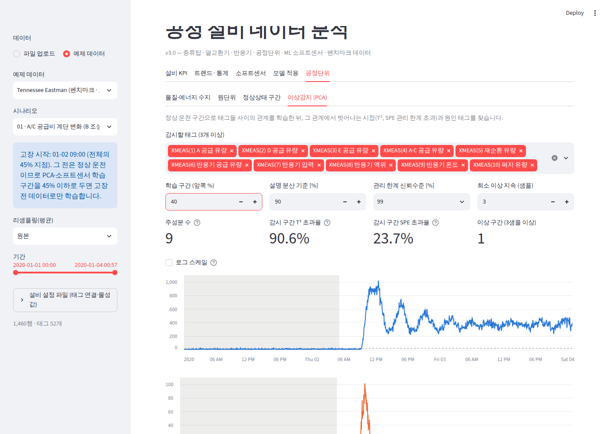


---

## 4. 설비 KPI 탭

첫 번째 탭입니다. 설비 유형별 하위 탭(**열교환기**, **반응기**)에서 태그를 연결하고 물성값을 넣으면 성능 지표(KPI)를 계산합니다.

- 계산한 KPI는 `[HX] U [W/m²K]`, `[RX] WABT [℃]` 처럼 **[HX]/[RX] 이름표**가 붙은 컬럼으로 추가되어, 다른 모든 탭(트렌드·통계, 소프트센서, 모델 적용, 공정단위)에서 일반 태그처럼 고를 수 있습니다.
- 연결하지 않은 설비는 아무것도 계산하지 않습니다. 필요한 설비만 설정하세요. 설비 분석이 필요 없다면 바로 **트렌드 · 통계** 탭으로 가면 됩니다 (v1과 같은 사용법).
- 한 번 설정한 연결은 **설비 설정 파일**로 저장해 두면 다음에 한 번에 불러올 수 있습니다 (4.3).

### 4.1 열교환기

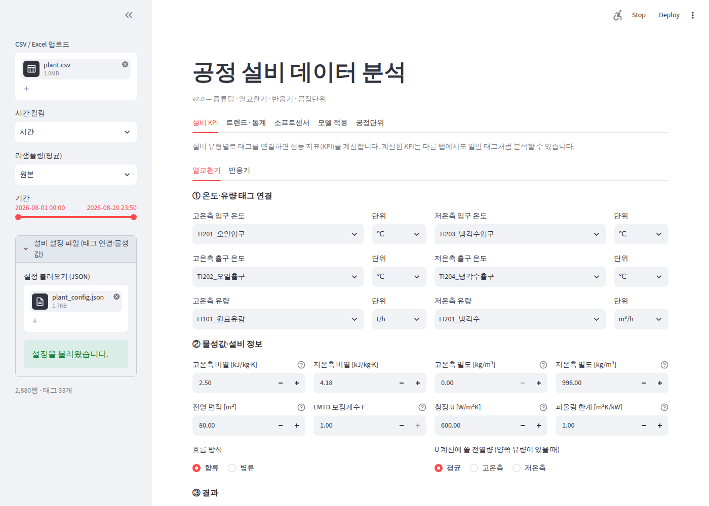

**① 온도·유량 태그 연결** — 왼쪽이 고온측, 오른쪽이 저온측입니다. 각 태그 옆에서 **단위**를 고르세요.

| 항목 | 필수 | 단위 선택 |
|---|---|---|
| 고온측 입구·출구 온도, 저온측 입구·출구 온도 | 4개 모두 필수 | ℃ / K / ℉ |
| 고온측 유량, 저온측 유량 | 하나 이상 (둘 다 있으면 열수지 점검 가능) | kg/h / t/h / kg/s / m³/h |

**② 물성값·설비 정보**

| 항목 | 설명 |
|---|---|
| 비열 [kJ/kg·K] | 유체의 평균 비열. kcal/kg·℃ 값이면 × 4.187. 물 ≈ 4.18, 탄화수소 액체 ≈ 2.0~2.6 |
| 밀도 [kg/m³] | 유량 단위가 **m³/h 일 때만** 필요 (0 = 미사용) |
| 전열 면적 [m²] | 입력하면 U, 파울링 저항까지 계산. 0이면 UA만 계산 |
| LMTD 보정계수 F | 순수 향류/병류 = 1. 다패스 쉘앤튜브는 설계서 값(보통 0.8~0.95) |
| 청정 U [W/m²K] | 설계값 또는 세정 직후 U. 0이면 데이터 상위 5% U를 청정 기준으로 사용 |
| 파울링 한계 [m²K/kW] | 세정 기준. 입력하면 도달 예상일을 계산 (0 = 미사용) |
| 흐름 방식 | 향류(대부분의 쉘앤튜브·판형) / 병류 |
| U 계산에 쓸 전열량 | 양쪽 유량이 다 있을 때: 평균 / 고온측 / 저온측 (더 믿을 만한 쪽) |

**③ 결과**

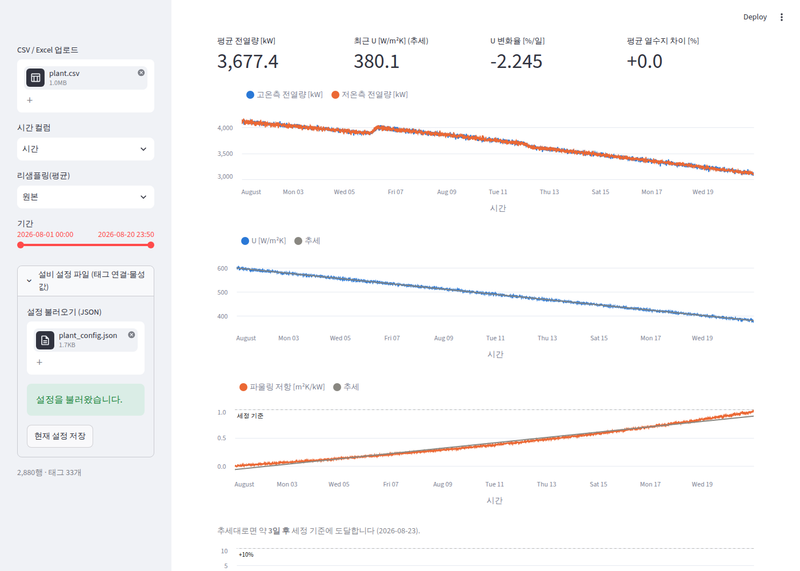

| 결과 | 계산식 · 의미 |
|---|---|
| 고온측/저온측 전열량 [kW] | Q = 질량유량 × 비열 × 온도차 |
| 열수지 차이 [%] | (Q고온 − Q저온) ÷ 평균 × 100. ±10%를 자주 벗어나면 계기·물성값 점검 |
| LMTD [℃] | 대수평균온도차. 향류: ΔT₁ = 고온입구 − 저온출구, ΔT₂ = 고온출구 − 저온입구 |
| 최소 온도차 [℃] | ΔT₁, ΔT₂ 중 작은 값 (접근 온도) |
| UA [kW/K], U [W/m²K] | UA = Q ÷ (F × LMTD), U = UA ÷ 면적 |
| 파울링 저항 [m²K/kW] | 1/U − 1/U청정 (× 1000). 0에서 커질수록 오염 진행 |
| U 변화율 [%/일], 세정 기준 도달 예상 | 추세선(직선) 기준 (10.21) |

> 예: 샘플 데이터(U가 20일 동안 600 → 380으로 떨어지도록 만든 데이터)에서 최근 U 380.1, 열수지 차이 0.0%로 정확히 계산됩니다.

### 4.2 반응기

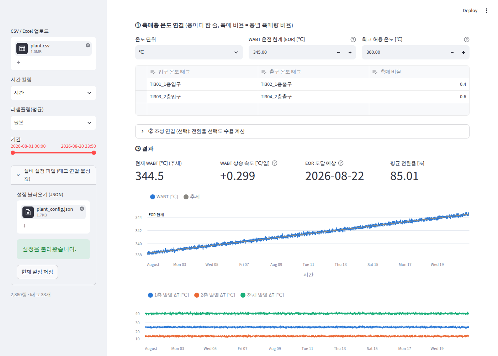

**① 촉매층 온도 연결** — 층마다 한 줄씩 입구 온도 태그, 출구 온도 태그, **촉매 비율**(층별 촉매량 비율, 예: 40%/60% → 0.4/0.6)을 입력합니다. 줄은 표 아래 빈 칸을 눌러 추가하고, 왼쪽 칸을 선택해 삭제합니다 (최대 20층, v3.0까지는 7층). 8층 이상이면 층별 ΔT는 시간 추이 대신 **기간 평균 막대**로 비교하고, 전체 ΔT는 시간 추이로 보여 줍니다 (색으로 구분할 수 있는 선이 8개까지이기 때문).

| 항목 | 설명 |
|---|---|
| 온도 단위 | 모든 촉매층 온도에 공통 |
| WABT 운전 한계 (EOR) | 운전 말기(End of Run) 기준 WABT. 입력하면 도달 예상일 계산 |
| 최고 허용 온도 | 설계 최고 온도. 초과 시간 비율 표시 |

**② 조성 연결 (선택)** — 전환율·선택도·수율을 보려면 입구 총유량, (출구 총유량), 반응물 입구·출구 분율, 생성물 출구(·입구) 분율, 화학양론 계수 ν를 연결합니다. **유량과 분율은 같은 기준(몰 또는 질량)** 이어야 합니다.

**③ 결과**

| 결과 | 계산식 · 의미 |
|---|---|
| 층별·전체 발열 ΔT | 출구 − 입구 온도. 발열 반응의 진행 정도 |
| WABT | Σ(촉매 비율 × (입구+출구)/2) ÷ Σ촉매 비율. 촉매층 대표 온도 |
| WABT 상승 속도 [℃/일] | 추세선 기울기 ≈ 촉매 활성 저하 속도 (10.16) |
| EOR 도달 예상 | 추세대로 WABT가 운전 한계에 도달하는 날짜 |
| 최고 온도 | 모든 층 온도 중 최댓값 (핫스팟 감시) |
| 전환율 [%] | (1 − 출구유량×반응물출구분율 ÷ (입구유량×반응물입구분율)) × 100 |
| 선택도 [%] | 생성된 생성물 ÷ ν ÷ 소비된 반응물 × 100 |
| 수율 [%] | 전환율 × 선택도 ÷ 100 |

> 예: 샘플 데이터(WABT가 하루 0.3℃ 오르도록 만든 데이터)에서 상승 속도 +0.299 ℃/일, EOR(345℃) 도달 예상 2026-08-22, 전환율 85.01%로 계산됩니다.

### 4.3 설비 설정 파일 (저장·불러오기)

사이드바 **설비 설정 파일 (태그 연결·물성값)** 을 펼칩니다.

- **현재 설정 저장**: 설비 KPI 탭과 공정단위 탭의 모든 태그 연결, 단위, 물성값, 표(촉매층, 수지 흐름, 원단위, 정상상태 허용 변동폭), PCA·변화점 설정, 상관분석 탭의 선택(변수·상관 종류·X/Y·모델·지연)을 `equipment_config.json` 으로 저장합니다.
- **설정 불러오기**: 저장한 파일을 올리면 그대로 복원됩니다. 현재 데이터에 없는 태그는 연결하지 않고 목록으로 알려줍니다.
- 설비별로 파일을 나눠 두면 편합니다 (예: `equipment_config_E-101.json`, `equipment_config_R-201.json`).
- 파일에는 운전데이터가 들어 있지 않지만 태그 이름·설비 사양이 들어 있으므로 대외비로 관리하세요 (9.2).

### 4.4 KPI를 다른 탭에서 활용하기

| 하고 싶은 것 | 방법 |
|---|---|
| U 저하와 냉각수 온도의 관계 보기 | 트렌드·통계 탭에서 `[HX] U [W/m²K]` 와 냉각수 입구 온도를 **태그별 분리**로 |
| 전환율을 온도·유량으로 예측 | 소프트센서 탭에서 예측 대상 = `[RX] 전환율 [%]` |
| 정상 운전일 때의 U만 비교 | 공정단위 → 정상상태 구간에서 조건을 적용한 뒤 트렌드·통계에서 확인 |
| U 저하를 다른 이상과 함께 감시 | 공정단위 → 이상감지(PCA)에 `[HX] U` 를 포함 |

---

## 5. 트렌드 · 통계 탭 / 상관분석 탭

5.1~5.3은 트렌드·통계 탭, 5.4~5.8은 v3.1의 **상관분석** 탭입니다.

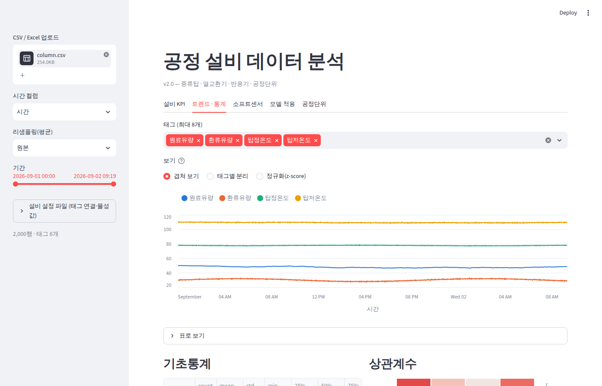

### 5.1 태그 선택과 보기 방식

1. **태그** 에서 보고 싶은 태그를 선택합니다 (기본: 앞쪽 4개, **최대 20개**, v3.0까지는 8개).
   - 한 그래프에서 색으로 구분되는 선은 8개까지라서, **9개 이상**이면 보기 방식과 관계없이 **태그별 분리**로 그립니다 (안내 문구 표시).
   - 20개보다 많은 변수의 관계는 **상관분석** 탭(개수 제한 없음)에서 보세요.
   - 태그마다 색이 정해지고, 다른 태그를 넣거나 빼도 **이미 선택된 태그의 색은 바뀌지 않습니다.**
2. **보기** 방식 선택

| 보기 | 언제 쓰나 |
|---|---|
| **겹쳐 보기** | 단위·크기가 비슷한 태그끼리 비교 (예: 단별 온도) |
| **태그별 분리** | 단위가 다른 태그를 각자의 세로축으로 위아래로 나란히 (DCS 트렌드 화면과 비슷) |
| **정규화(z-score)** | 단위가 다른 태그의 **변동 패턴**을 한 그래프에서 비교. (값 − 평균) / 표준편차 |

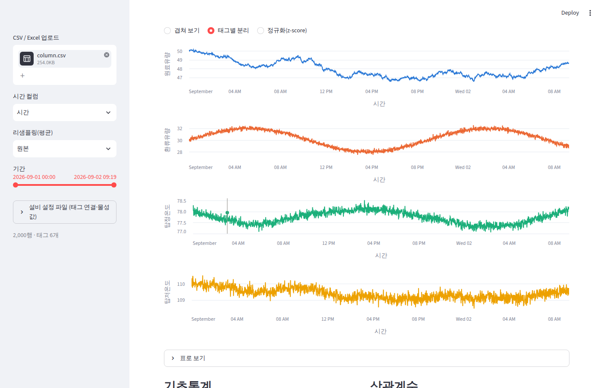

### 5.2 그래프 조작

| 동작 | 결과 |
|---|---|
| 마우스를 그래프 위에 올림 | 세로선과 함께 그 시각의 값 표시 |
| 마우스 휠 (그래프 위에서) | 시간축 확대/축소. 페이지를 스크롤하려면 그래프 바깥(여백·표)에서 휠을 굴리거나 오른쪽 스크롤바 사용 |
| 드래그 | 시간축 이동 |
| 더블클릭 | 원래 범위로 |
| 그래프 오른쪽 위 아이콘 | 이미지 저장, 전체 화면 |
| **표로 보기** | 그래프의 값을 표로 확인 (복사 가능) |

### 5.3 기초통계와 상관계수

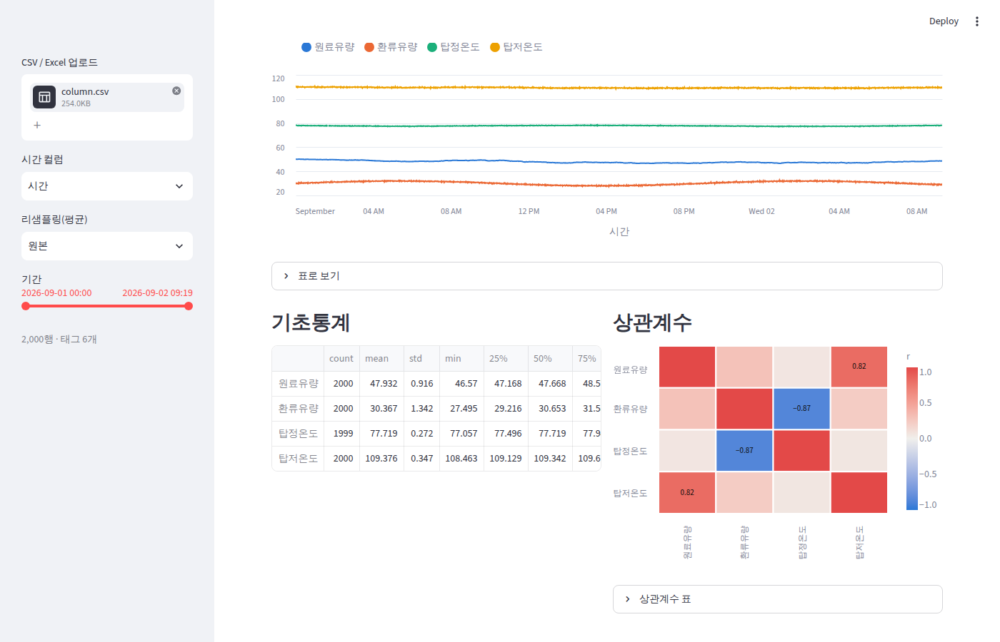

- **기초통계**: 개수(count), 평균(mean), 표준편차(std), 최소/최대, 사분위수
  - count가 다른 태그보다 적으면 그만큼 결측(Bad 값 등)이 있다는 뜻입니다.
- **상관계수 히트맵**: −1 ~ 1
  - **빨강**: 같이 오르내림(양의 상관), **파랑**: 반대로 움직임(음의 상관), **회색**: 관계 없음
  - 상관이 강한 쌍(|r| ≥ 0.7)만 숫자를 표시합니다. 칸에 마우스를 올리면 모든 값을 볼 수 있고, **상관계수 표** 에 전체 값이 있습니다.
  - 소프트센서 입력 변수를 고를 때 참고하세요. 예측 대상과 상관이 큰 태그가 후보이고, **입력 변수끼리 상관이 큰 쌍(|r| ≥ 0.9)** 이 있으면 PLS를 쓰는 것이 좋습니다.
  - 이 히트맵은 선택한 태그의 **피어슨 상관만** 보여 줍니다. 곡선 관계·p값·회귀·잔차·시차 분석은 5.4 **상관분석** 탭에서 합니다.


### 5.4 상관분석 탭 (v3.1) — 개요

장치 종류와 관계없이 **숫자 변수 사이의 관계**를 분석하는 탭입니다. 공정 데이터뿐 아니라 실험·품질·유틸리티·판매 데이터 등 어떤 숫자 데이터에도 쓸 수 있습니다. 하위 탭 5개로 구성됩니다.

| 하위 탭 | 하는 일 | 대표 질문 |
|---|---|---|
| **상관 행렬** | 모든 변수 쌍의 관계를 한눈에, 강한 순으로 | "어떤 변수들이 같이 움직이나?", "곡선 관계는 없나?" |
| **이변량 회귀** | 두 변수의 관계를 식으로 (6가지 모델) | "반응온도가 1℃ 오르면 수율이 얼마나 바뀌나?" |
| **잔차 분석** | 회귀 모델이 놓친 패턴 진단 | "이 식을 믿어도 되나?" |
| **시차 상관 · 선후 관계** | 한 변수가 바뀐 뒤 다른 변수가 반응하기까지의 시간, 선후 관계 검정 | "원료 조성이 바뀌고 몇 분 뒤 제품에 나타나나?" |
| **운전 구간별 비교** | 운전 모드(구간)를 나눠 전체 상관과 구간 안 상관 비교 | "압력을 바꿔 운전한 기간이 섞여서 관계가 흐려진 건 아닌가?" |

> 사이드바의 기간·리샘플링, 정상상태 필터(8.3)가 그대로 적용되며, 설비 KPI 컬럼(`[HX] U` 등)도 변수로 쓸 수 있습니다.

### 5.5 상관 행렬

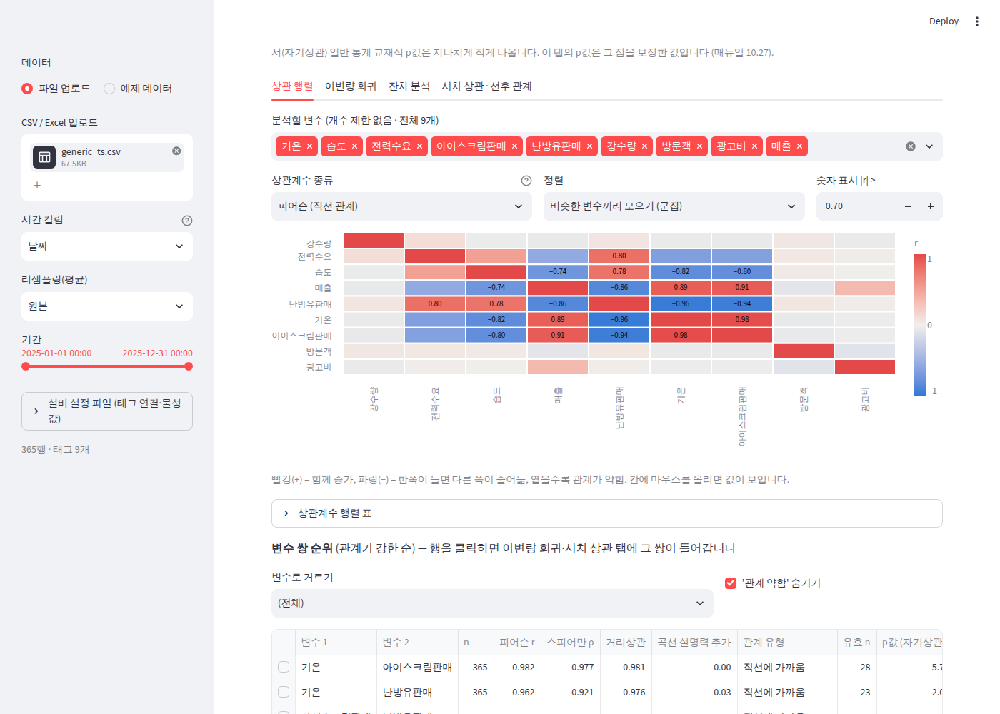

| 설정 | 설명 |
|---|---|
| **분석할 변수** | **개수 제한 없음** (기본: 앞쪽 60개). 값이 3개 미만이거나 변하지 않는 변수는 자동 제외하고 이름을 알려 줍니다 |
| **상관계수 종류** | **피어슨**(직선 관계), **스피어만**(순위 기반, 한 방향으로 휘는 곡선도 잡음), **켄달**(순위 기반, 이상값에 가장 강함), **편상관**(선택한 나머지 변수의 영향을 뺀 '직접' 관계) — 10.27 |
| **정렬** | **비슷한 변수끼리 모으기(군집)**: 관계가 강한 변수들이 붙어 있도록 순서를 바꿔 덩어리(블록)가 보입니다. **선택한 순서**: 고른 순서대로 |
| **숫자 표시 \|r\| ≥** | 이 값 이상인 칸에만 숫자 표시 (변수 20개 이하일 때). 모든 값은 마우스를 올리거나 **상관계수 행렬 표** 에서 확인 |

- 색: **빨강(+)** 함께 증가, **파랑(−)** 반대로 움직임, 옅을수록 약함. 행렬 표와 CSV 다운로드를 제공합니다.

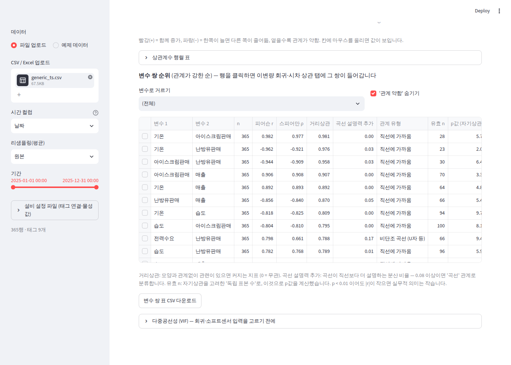

**변수 쌍 순위** — 모든 변수 쌍을 관계가 강한 순으로 나열합니다.

| 열 | 의미 |
|---|---|
| 피어슨 r / 스피어만 ρ | 직선 관계 / 순위(단조) 관계의 세기와 방향 (−1 ~ 1) |
| 거리상관 | 모양과 관계없이 관련이 있으면 커지는 지표 (0 = 무관, 1 = 완전 관련). U자 관계도 잡습니다 (10.28) |
| 곡선 설명력 추가 | 자유 곡선이 직선보다 더 설명하는 분산 비율. 0.08 이상이면 '곡선' 관계로 분류 |
| 관계 유형 | **직선에 가까움** / **단조 곡선 (비선형)** (한 방향으로 휨, 예: 지수) / **비단조 (U자 곡선 또는 운전 모드 혼재)** (올라갔다 내려오거나, 운전 조건이 다른 기간이 섞여 점들이 여러 덩어리로 나뉨) / **관계 약함** |
| 유효 n | 자기상관(이웃 시점끼리 비슷함)을 고려한 '독립 표본 수'. 행 수보다 훨씬 작을 수 있습니다 (10.27) |
| p값 (자기상관 보정) | 유효 n으로 계산한 p값. 작을수록 우연이 아님. 단, **p가 작아도 \|r\|이 작으면 실무적 의미는 작습니다** |

- **변수로 거르기**: 특정 변수가 들어간 쌍만 보기 (예: 제품 순도와 관계있는 변수 찾기).
- **'관계 약함' 숨기기**: 기본으로 켜져 있습니다.
- 표에서 **행을 클릭**하면 그 쌍이 이변량 회귀·시차 상관 탭의 X·Y로 들어갑니다.
- **다중공선성 (VIF)** 펼침: **VIF 계산** 을 켜면 변수마다 VIF를 계산합니다 (10.32). 변수가 많으면 몇 초 걸려서 켤 때만 계산합니다. 차압(= 하부 압력 − 상부 압력)처럼 다른 태그로 **정확히 계산되는 태그**는 VIF **∞ · 완전 중복** 으로 표시됩니다.
- **운전 모드가 섞인 데이터**: 압력·부하 운전 조건이 다른 기간이 섞이면, 기간마다 강한 관계도 전체로는 약하게 나오고 '비단조'로 분류됩니다. 이변량 회귀의 **점 색 = 시간 순서** 로 덩어리를 확인하고, 공정단위 → **변화점 탐지** 로 찾은 구간을 사이드바 **기간** 으로 골라 다시 보세요.

> 실제 운전데이터 테스트 예 (증류탑, 수년치): 탑 압력을 높여 운전한 기간이 섞여 있어, 한 압력과 유량의 상관이 전체로는 r ≈ 0.3(비단조)이지만 기간별로는 0.9 이상이었습니다. 이런 경우 **5.9 운전 구간별 비교** 에서 한 번에 확인할 수 있습니다.

> 예: 기온·습도·전력수요·판매량 등 365일치 일반 데이터에서 기온–전력수요는 피어슨 r = −0.65로 "보통 음의 상관"처럼 보이지만, 관계 유형은 **비단조 (U자 곡선 또는 운전 모드 혼재)**, 곡선 설명력 추가 0.48로 표시됩니다 (여름·겨울 모두 수요 증가). 이변량 회귀에서 2차 다항식을 고르면 R²가 0.42 → 0.99로 올라갑니다.

### 5.6 이변량 회귀

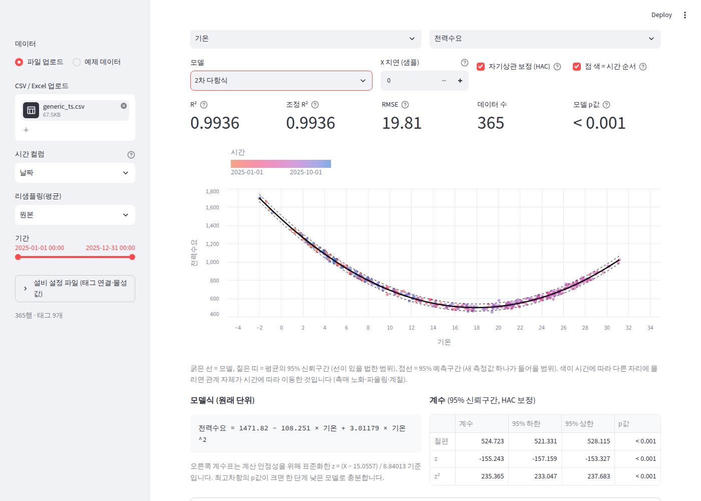

| 설정 | 설명 |
|---|---|
| **X (설명 변수) / Y (반응 변수)** | Y를 X로 설명합니다. 변수 쌍 표에서 행을 클릭하면 자동 입력 |
| **모델** | 선형, 2차·3차 다항식, 로그(y = a + b·ln x), 지수(y = a·e^(bx)), 거듭제곱(y = a·x^b) — 10.29 |
| **X 지연 (샘플)** | Y(t)를 X(t − 지연)으로 설명. 시차 상관 탭에서 찾은 지연을 넣으세요 |
| **자기상관 보정 (HAC)** | Newey-West 표준오차로 신뢰구간·p값을 보정 (기본 켬). 시계열 데이터에서는 켜 두세요 |
| **점 색 = 시간 순서** | 점을 시간 순서대로 주황 → 파랑으로 칠합니다. 색이 다른 자리에 몰리면 관계 자체가 시간에 따라 이동한 것 (촉매 노화·파울링·계절) |

| 결과 | 의미 |
|---|---|
| R² / 조정 R² | Y 변동 중 모델이 설명하는 비율. 모델끼리 비교할 때는 항이 많은 모델에 벌점을 준 **조정 R²** |
| RMSE | 예측 오차의 크기 (Y 단위) |
| 모델 p값 | "X와 Y가 무관하다"를 기각하는 근거. HAC를 켜면 보정된 값 |
| 굵은 선 / 짙은 띠 / 점선 | 모델 / **평균의 95% 신뢰구간** (선이 있을 법한 범위) / **95% 예측구간** (새 측정값 하나가 들어올 범위) |
| 모델식 (원래 단위) | 그대로 계산기·DCS에 옮길 수 있는 식 |
| 계수표 | 계수, 95% 신뢰구간, p값. 다항식은 계산 안정성을 위해 표준화한 z = (X − 평균)/표준편차 기준이며, **최고차항의 p값이 크면 한 단계 낮은 모델로 충분**합니다 |
| **모델 비교** 펼침 | 같은 X·Y로 6가지 모델의 R²·조정 R²·RMSE. 쓸 수 없는 모델(예: X에 0 이하 값이 있어 로그 불가)은 이유를 표시 |

- 모든 모델의 R²·RMSE·잔차는 **Y의 원래 단위** 기준입니다 (지수·거듭제곱은 로그 공간에서 맞춘 뒤 되돌림). 그래서 모델 비교표를 그대로 비교할 수 있습니다.
- 점이 5,000개를 넘으면 그래프에는 고르게 뽑은 5,000개만 그리고, 계산에는 전체를 씁니다.

### 5.7 잔차 분석

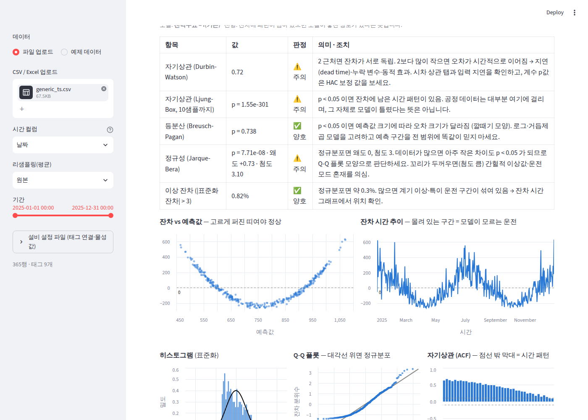

이변량 회귀 탭의 모델에서 **잔차 = 실측 − 모델** 을 진단합니다. 잔차에 패턴이 남아 있으면 모델이 놓친 정보가 있다는 뜻입니다. (소프트센서 모델의 잔차 진단은 6.9)

| 항목 | 양호 기준 | 주의일 때 의미 · 조치 |
|---|---|---|
| **자기상관 (Durbin-Watson)** | 1.5 ~ 2.5 | 오차가 시간적으로 이어짐 → 지연(dead time)·누락 변수·동적 효과. 시차 상관 탭·입력 지연 확인, p값은 HAC 보정 값 사용 |
| **자기상관 (Ljung-Box)** | p ≥ 0.05 | 잔차에 시간 패턴이 남음. 공정 데이터는 대부분 여기에 걸리며, 그 자체로 모델이 틀렸다는 뜻은 아님 |
| **등분산 (Breusch-Pagan)** | p ≥ 0.05 | 값이 클수록 오차도 커지는 깔때기 모양 → 로그·거듭제곱 모델 고려, 예측구간을 전 범위에 똑같이 믿지 말 것 |
| **정규성 (Jarque-Bera)** | p ≥ 0.05, 또는 왜도 < 0.5·첨도 < 4.5 | 꼬리가 두꺼우면 간헐적 이상값·운전 모드 혼재. 데이터가 많으면 작은 차이도 p < 0.05가 되므로 **Q-Q 플롯 모양**으로 판단 |
| **이상 잔차 (\|표준화 잔차\| > 3)** | 1% 이하 | 계기 이상·특이 운전 구간이 섞여 있음 → 잔차 시간 그래프에서 위치 확인 |

| 그래프 | 정상일 때 모습 | 이상일 때 |
|---|---|---|
| 잔차 vs 예측값 | 0 주위로 고르게 퍼진 띠 | 곡선 모양 → 모델 형태가 틀림 (다항식 등으로), 깔때기 → 등분산 위반 |
| 잔차 시간 추이 | 0 주위의 잡음 | 계단·기울기 → 운전 조건 변화·계기 드리프트, 몰린 구간 → 모델이 모르는 운전 |
| 히스토그램 | 검은 정규분포 곡선과 비슷 | 한쪽 치우침, 봉우리 2개(운전 모드 2개) |
| Q-Q 플롯 | 대각선 위 | 양 끝이 대각선에서 벗어남 → 꼬리가 두꺼움 |
| 자기상관 (ACF) | 막대가 점선 안 | 점선 밖 막대가 많음 → 시간 패턴 |

- **영향점** 펼침: 쿡의 거리(Cook's distance)가 4/n을 넘는 점 중 상위 10개. 혼자서 회귀선을 크게 움직이는 점입니다. 계기 이상이면 기간 설정으로 빼고 다시 보고, 정상 데이터라면 지우지 말고 "그 영역의 데이터가 부족하다"는 신호로 보세요.

> 예: 365일치 기온–전력수요를 **선형**으로 맞추면 잔차 vs 예측값이 뚜렷한 U자 곡선이고 Durbin-Watson 0.72(자기상관 '주의'), 정규성 '주의'가 나옵니다 — 모델 형태가 틀려서 계절 패턴이 잔차에 남은 것입니다. **2차 다항식**으로 바꾸면 R² 0.42 → 0.99, Durbin-Watson 1.93으로 5개 항목이 모두 '양호'가 됩니다.

### 5.8 시차 상관 · 선후 관계

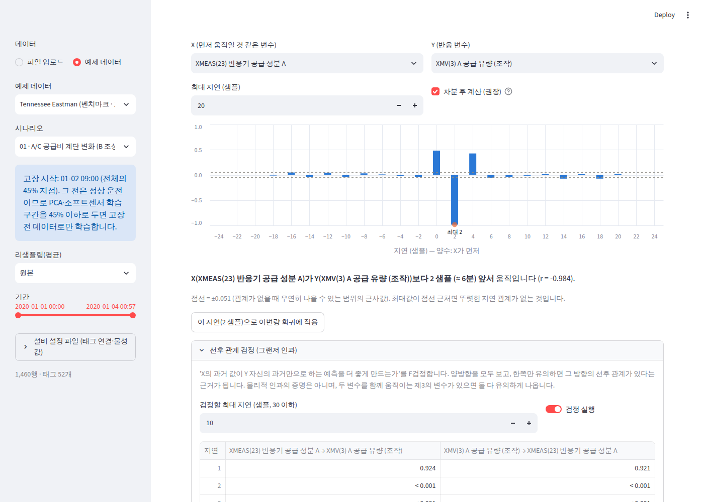

| 설정 | 설명 |
|---|---|
| **X / Y** | X = 먼저 움직일 것 같은 변수, Y = 반응 변수 |
| **최대 지연 (샘플)** | ± 이 범위에서 X를 밀어 가며 상관을 계산 (최대 1,000) |
| **차분 후 계산 (권장)** | 값 대신 '변화량'끼리 상관을 봅니다. 두 변수가 모두 천천히 드리프트하면 모든 지연에서 상관이 높게 나와 봉우리가 묻히는데, 차분하면 그 착시가 사라집니다 |

- 막대 그래프의 **가장 높은 봉우리 위치**가 지연입니다. **양수**: X가 먼저, **음수**: Y가 먼저, 0: 동시에. 결과 문장에 샘플 수와 시간 환산(예: "12 샘플 (≈ 36분)")이 나옵니다.
- 점선(±1.96/√n)은 "관계가 없을 때 우연히 나올 수 있는 범위"의 근사입니다. 최대값이 점선 근처면 뚜렷한 지연 관계가 없는 것입니다.
- **이 지연으로 이변량 회귀에 적용** 버튼: X·Y·X 지연을 이변량 회귀 탭에 넣습니다 (Y가 먼저면 X·Y를 바꿔서). 소프트센서의 **입력 지연** 에도 같은 값을 쓸 수 있습니다.
- **선후 관계 검정 (그랜저 인과)** 펼침 → **검정 실행**: "X의 과거가 Y 자신의 과거만으로 하는 예측을 더 좋게 만드는가"를 양방향으로 F검정합니다 (10.31). 데이터가 1만 행을 넘으면 최근 1만 행으로 검정합니다.

| 판정 | 의미 |
|---|---|
| X → Y 만 유의 | X의 변화가 Y보다 먼저 나타난다는 근거 |
| 양방향 모두 유의 | 제어 루프(되먹임) 또는 두 변수를 함께 움직이는 공통 원인이 있을 가능성 |
| 둘 다 유의하지 않음 | 선후 관계의 근거 없음 (관계가 동시적이거나 없음) |

> 예: Tennessee Eastman 고장 1에서 X = `XMEAS(23) 반응기 공급 성분 A`(분석계), Y = `XMV(3) A 공급 유량 (조작)` 으로 보면 **"X가 Y보다 2 샘플 (≈ 6분) 앞서 움직입니다 (r = −0.984)"** 가 나옵니다. 분석계가 A 성분이 늘어난 것을 알리면 6분 뒤 제어기가 A 공급을 줄이는 **제어 루프**입니다. 그랜저 검정은 양방향 모두 유의로 나오는데, 되먹임 루프의 전형적인 모습입니다.

### 5.9 운전 구간별 비교

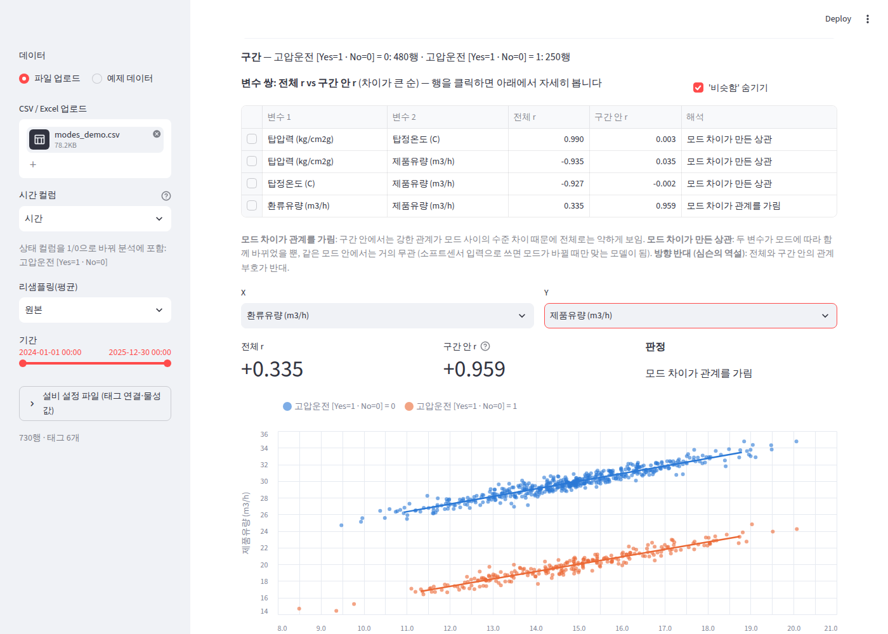

운전 모드(압력·부하·원료 등급, 설비 개조 전후 등)가 다른 기간이 한 데이터에 섞여 있으면, 모드 사이의 **수준 차이**가 상관을 부풀리거나 가립니다. 이 탭은 구간을 나눈 뒤, 전체 상관과 **구간 안 상관**(각 구간 평균에서 벗어난 정도끼리의 상관)을 비교합니다 (10.35).

| 설정 | 설명 |
|---|---|
| **구간 나누기 → 변화점 탐지로 (자동)** | 운전 모드를 대표하는 태그(압력·유량·부하)와 민감도를 고르면 8.5와 같은 방법(평균 변화)으로 구간을 나눕니다 |
| **구간 나누기 → 상태 컬럼 값으로** | 값이 2~10가지인 컬럼(예: 1/0으로 바뀐 `Preheating [Yes=1 · No=0]`, 운전 모드 번호)의 값별로 나눕니다. 떨어져 있는 기간도 같은 값이면 같은 구간입니다 |

| 결과 | 의미 |
|---|---|
| 구간 목록 | 구간 이름(기간 또는 상태 값)과 행 수 |
| **변수 쌍 표** | 모든 변수 쌍의 전체 r, 구간 안 r, 해석. 두 값의 차이가 큰 순. **'비슷함' 숨기기** 기본 켬. 행을 클릭하면 아래 상세로 |
| 해석: **모드 차이가 관계를 가림** | 구간 안에서는 강한 관계가, 모드 사이 수준 차이 때문에 전체로는 약하게 보임 → 모드별로 모델을 만들거나 모드를 나타내는 변수를 입력에 추가 |
| 해석: **모드 차이가 만든 상관** | 두 변수가 모드에 따라 함께 바뀌었을 뿐, 같은 모드 안에서는 거의 무관 → 소프트센서 입력으로 쓰면 모드가 바뀔 때만 맞는 모델이 됨 |
| 해석: **방향 반대 (심슨의 역설)** | 전체와 구간 안의 관계 부호가 반대 → 전체 상관으로 판단하면 반대 결론 |
| 상세: 전체 r · 구간 안 r · 판정 | 고른 X·Y에 대한 값 |
| 상세: 구간별 산점도 | 점 = 측정값(구간별 색), 선 = 구간별 직선 회귀. 선들이 나란하면 관계는 같고 수준만 다름, 기울기가 다르면 모드에 따라 관계 자체가 다름 |
| 상세: 구간별 표 | 구간마다 행 수, 기간, 평균, r, 기울기, 절편, p값(자기상관 보정). 행이 5개 미만인 구간은 '-' |

> 예 (가상 데이터 `modes_demo`: 저압/고압 두 운전 모드, 상태 컬럼 `고압운전` = Yes/No): 탑 압력–탑정 온도는 전체 r = 0.99이지만 구간 안 r = 0.00으로 **모드 차이가 만든 상관**(모드가 바뀔 때 함께 바뀌었을 뿐), 환류 유량–제품 유량은 전체 r = 0.34이지만 구간 안 r = 0.96으로 **모드 차이가 관계를 가림** 으로 판정됩니다. 구간별 산점도에서 두 모드의 회귀선이 같은 기울기로 나란히 놓여, 관계는 같고 제품 유량 수준만 다르다는 것이 보입니다.

---

## 6. 소프트센서 탭

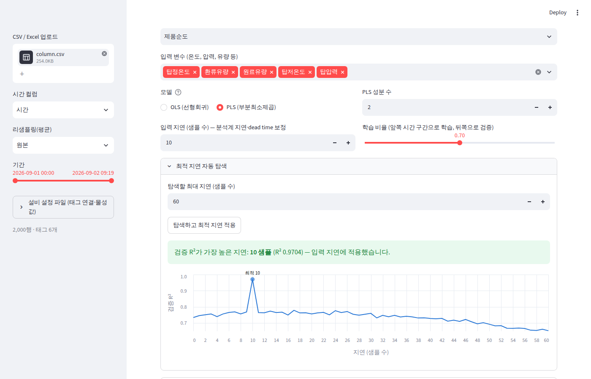

### 6.1 설정 항목

| 항목 | 설명 |
|---|---|
| **예측 대상** | 예측하려는 품질 변수 (제품 순도, 불순물 농도 등). 기본값은 마지막 컬럼 |
| **입력 변수** | 예측에 사용할 태그 (탑정/탑저 온도, 환류량, 원료량, 압력 등) |
| **모델** | OLS (선형회귀), PLS (부분최소제곱), **랜덤포레스트 · 그래디언트 부스팅 · 신경망 (MLP)** (v3 ML 모델). 6.5·6.8 참고 |
| **자동 튜닝 횟수** | ML 모델 선택 시에만 표시. 0 = 기본 설정, 숫자만큼 하이퍼파라미터 조합을 시험 (6.8, 10.23) |
| **PLS 성분 수** | PLS 선택 시에만 표시. 6.6 참고 |
| **입력 지연 (샘플 수)** | 입력 변수를 몇 샘플 뒤로 밀어서 예측 대상과 맞출지. 6.3 참고 |
| **학습 비율** | 앞쪽 시간 구간 몇 %로 모델을 만들고, 나머지 뒤쪽 구간으로 검증할지 (기본 70%, 30~90%) |

> 학습/검증을 **시간 순서로 나누는 이유**: 무작위로 섞으면 바로 옆 시점 데이터가 학습과 검증에 같이 들어가서 성능이 실제보다 좋게 나옵니다. 앞 구간으로 학습하고 뒤 구간을 맞히는 방식이 실제 운전에서 쓰는 상황과 같습니다.

### 6.2 결과 읽는 법

| 결과 | 의미 |
|---|---|
| **학습 R² / 검증 R²** | 1에 가까울수록 잘 맞음. 0이면 평균값을 찍는 수준. **검증 R²** 를 기준으로 판단하세요 |
| **학습 RMSE / 검증 RMSE** | 예측 오차의 크기 (예측 대상과 같은 단위). 분석계 정밀도와 비교해 보세요 |
| **실측 vs 예측 (시간)** | 파랑=실측, 주황=예측. **점선** 오른쪽이 검증 구간. 검증 구간에서 두 선이 벌어지면 모델이 새 운전조건을 못 따라간다는 뜻 |
| **패리티 플롯** | 가로=실측, 세로=예측. 회색=학습, 주황=검증. 점이 **대각선**에 붙을수록 정확. 검증 점이 대각선 위/아래 한쪽으로 몰리면 **편향(bias)** |
| **변수 영향도 – 표준화 계수** | 입력을 1 표준편차 바꿨을 때 예측값 변화. 절댓값이 클수록 영향이 큼. 부호는 방향(+ 증가, − 감소) |
| **변수 영향도 – 계수(원래 단위)** | 입력을 원래 단위로 1 바꿨을 때 예측값 변화 (예: 탑정온도 1℃ 상승 → 순도 −0.77%) |
| **▼ 잔차 알람** (v3) | 검증 구간에서 \|실측 − 예측\| 이 한계를 넘은 시점. 모든 모델에 표시. 정상이면 약 1%, 몰려 나오면 분석계·계기 이상 또는 모델이 모르는 운전 (10.24) |
| **변수 영향도 – 순열 중요도** (v3, ML) | 그 입력을 무작위로 섞었을 때 R²가 떨어지는 정도 (10.25) |

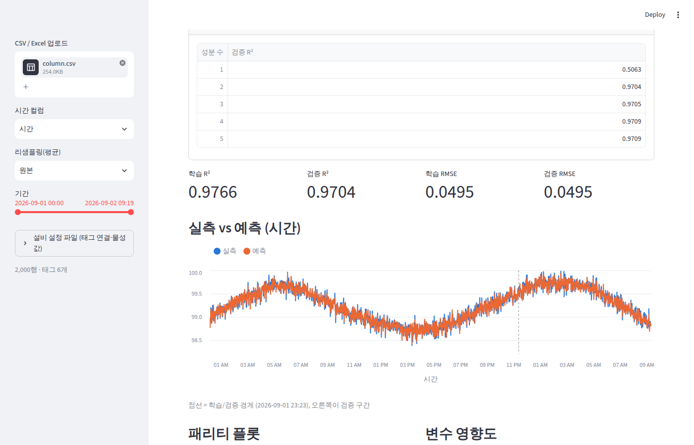

**판단 기준 예시**

- 학습 R² ≈ 검증 R², 둘 다 높음 → 좋은 모델
- 학습 R²는 높은데 검증 R²가 많이 낮음 → 과적합, 또는 검증 구간의 운전조건이 학습 구간과 다름. 입력 변수를 줄이거나 PLS 성분 수를 줄여 보세요
- 둘 다 낮음 → 중요한 입력 변수가 빠졌거나 지연이 맞지 않음

### 6.3 입력 지연 찾기 (자동 탐색)

증류탑은 입력(환류량, 스팀량 등)이 바뀌어도 제품 조성은 몇 분~몇십 분 뒤에 변합니다. 온라인 분석계(GC)도 샘플링·분석 시간만큼 늦게 값이 나옵니다.

1. **최적 지연 자동 탐색** 을 펼칩니다.
2. **탐색할 최대 지연** 을 정합니다 (기본 60 샘플). 공정 체류시간보다 넉넉하게 잡으세요.
3. **탐색하고 최적 지연 적용** 을 누르면 0 ~ 최대 지연까지 모두 모델을 만들어 보고,
   - 지연별 검증 R² 그래프를 그리고
   - 검증 R²가 가장 높은 지연을 **입력 지연** 칸에 자동으로 넣습니다.
4. 그래프에서 봉우리가 뚜렷하면 그 지연이 믿을 만합니다. 평평하면 지연의 영향이 작다는 뜻입니다.

- 지연 단위는 **샘플 수** 입니다. 1분 데이터에서 `10`은 10분, `10min` 리샘플링 후 `3`은 30분입니다.
- 탐색 결과는 예측 대상·입력 변수·모델·학습 비율을 바꾸면 사라집니다. 설정을 바꿨다면 다시 탐색하세요.

> 예: 샘플 데이터에서는 지연 0 → 검증 R² 0.81, 자동 탐색 결과 지연 10 → 0.97

### 6.4 모델식 (DCS 적용용)

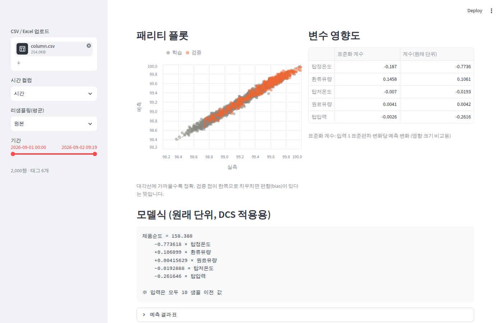

**모델식 (원래 단위)** 상자에 DCS 계산 블록이나 엑셀에 그대로 옮길 수 있는 식이 나옵니다.

```
제품순도 = 158.388
    -0.773618 × 탑정온도
    +0.106099 × 환류유량
    ...
※ 입력은 모두 10 샘플 이전 값
```

- 상자 오른쪽 위 복사 버튼으로 복사할 수 있습니다.
- 입력 지연을 썼다면 각 입력에 **그 샘플 수만큼 이전 값**을 넣어야 합니다 (DCS의 dead time/지연 블록 사용).
- 리샘플링을 썼다면 입력도 같은 간격의 평균값을 넣어야 합니다.

### 6.5 OLS와 PLS 중 무엇을 쓸까

| | OLS (선형회귀) | PLS (부분최소제곱) |
|---|---|---|
| 방식 | 입력 변수를 그대로 사용해 오차가 최소가 되는 직선을 찾음 | 입력 변수를 서로 독립인 몇 개의 **성분**으로 압축한 뒤 회귀 |
| 적합한 경우 | 입력 변수가 적고 서로 독립적일 때 | 입력 변수가 많거나 **서로 상관이 강할 때** (예: 3단·5단·7단 온도, 이중화 센서) |
| 주의 | 상관이 강한 변수가 같이 들어가면 계수가 크게 튀거나 부호가 뒤집힘 | 성분 수를 골라야 함 |

PLS 성분 수를 입력 변수 개수와 같게 하면 OLS와 결과가 같습니다.
입력 변수 중 사실상 똑같은 센서(이중화)가 있으면, 성분 수를 크게 잡아도 의미 있는 성분까지만 계산하고 멈춥니다.

### 6.6 PLS 성분 수 정하기

**성분 수별 검증 R²** 를 펼치면 성분 수마다 검증 R²가 표시됩니다.

- 검증 R²가 **더 이상 크게 오르지 않는 가장 작은 성분 수**를 고르세요.
- 예: 1개 0.506 → 2개 0.970 → 3개 0.971 → 5개 0.971 이면 **2개** 가 적당합니다. 성분이 적을수록 새 운전조건에서 안정적입니다.

### 6.7 결과 내보내기와 모델 저장

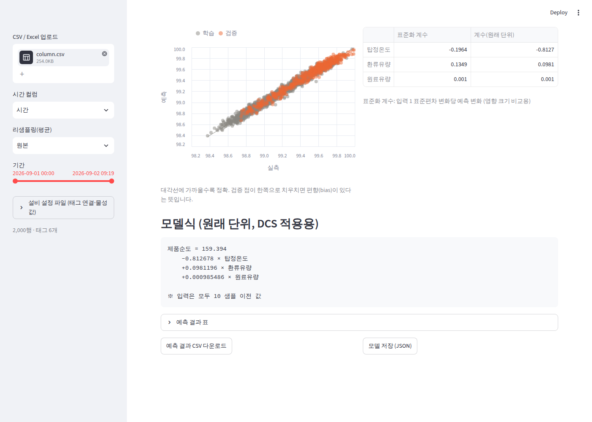

| 버튼 | 저장되는 것 | 용도 |
|---|---|---|
| **예측 결과 CSV 다운로드** | 시간별 실측·예측·구분(학습/검증) | Excel 분석, 보고서. 한글이 깨지지 않게 저장됩니다 |
| **모델 저장 (JSON)** | 모델식(절편·계수·입력 지연), 모델 종류, 리샘플링 간격, 학습 기간, 학습 시 성능, 저장 시각 | 7장 **모델 적용** 탭에서 새 데이터에 다시 적용. 모델 이력 관리 |

- 파일은 브라우저의 **다운로드 폴더**에 `softsensor_<예측대상>.json` 으로 저장됩니다.
- 모델 파일에는 **운전데이터 자체는 들어 있지 않습니다.** 태그 이름, 계수, 학습 기간, 성능 수치만 들어 있습니다. 다만 이것도 공정 노하우이므로 대외비로 관리하세요 (9장).
- 저장 전 확인할 것: 검증 R², 계수 부호가 공정 원리와 맞는지 (10.12), 지연 값.

> 예측 결과 표는 **예측 결과 표** 를 펼치면 화면에서도 볼 수 있습니다.


### 6.8 ML 모델 — 랜덤포레스트 · 그래디언트 부스팅 · 신경망 (v3)

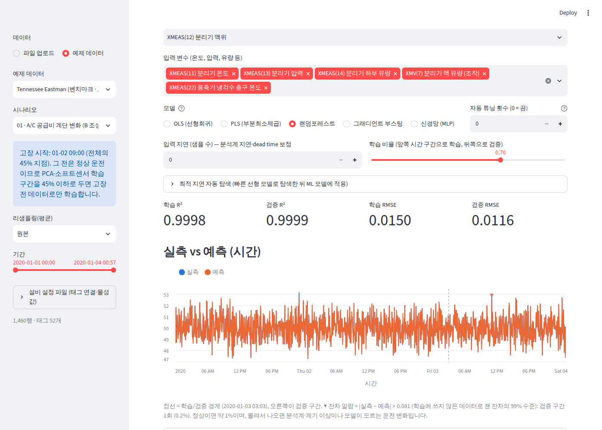

1. 예측 대상과 입력 변수는 OLS/PLS와 똑같이 고릅니다.
2. **모델** 에서 **랜덤포레스트**, **그래디언트 부스팅**, **신경망 (MLP)** 중 하나를 고릅니다. 학습에 몇 초 걸리며, 같은 설정은 다시 계산하지 않습니다.
3. (선택) **자동 튜닝 횟수** 에 5~20 정도를 넣으면 Optuna가 모델 설정(나무 개수·깊이·학습률 등)을 그 횟수만큼 바꿔 가며 가장 좋은 조합을 찾습니다. 횟수만큼 느려집니다.
4. **입력 지연** 은 그대로 적용됩니다. **최적 지연 자동 탐색** 은 빠른 선형 모델로 찾은 지연을 ML 모델에 적용합니다.

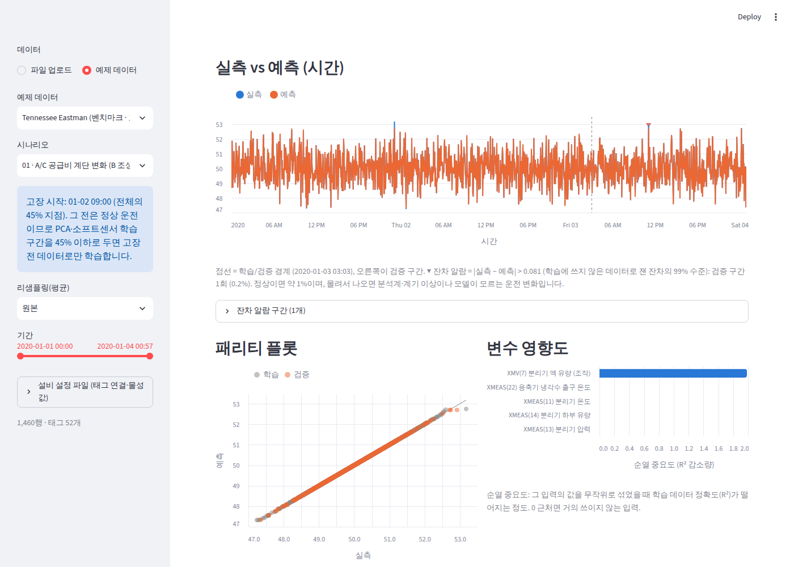

| ML 모델에서 달라지는 것 | 내용 |
|---|---|
| 변수 영향도 | 계수 대신 **순열 중요도** 막대 그래프 |
| 자동 튜닝 결과 | 튜닝을 켰으면 찾은 설정값 표시 |
| 잔차 알람 한계 | 학습에 쓰지 않은 데이터로 잰 잔차 기준 (ML은 학습 데이터에 지나치게 잘 맞기 때문, 10.24) |
| 모델식 · 모델 저장 | **없음.** ML 모델은 수식으로 표현되지 않아 DCS 계산 블록에 옮길 수 없고, 파일로 저장·불러오는 방식은 불러올 때 코드가 실행될 수 있어 제공하지 않습니다 (9.2) |

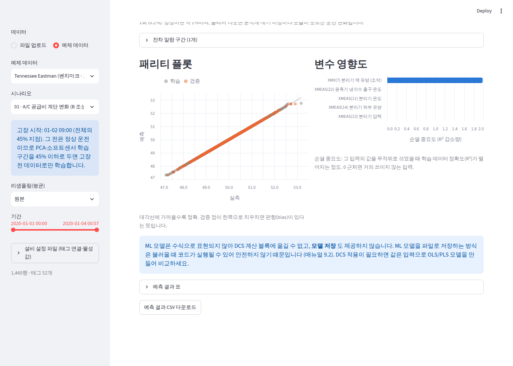

**선형 모델과 ML 모델 중 무엇을 쓸까** — 먼저 **OLS/PLS** 로 만들어 보고, 검증 R²가 부족할 때 ML을 같은 입력으로 비교하세요. ML이 **검증 R²** 에서 확실히 나을 때만 쓰는 것이 좋습니다 (10.22).

> 예: Tennessee Eastman 정상 운전에서 분리기 액위를 분리기 온도·압력·유량으로 예측하면 OLS 검증 R² 1.000, 랜덤포레스트 0.9999 — 변수 관계가 거의 선형이라 ML의 이득이 없습니다. 반대로 입력과 품질이 곡선·문턱 관계인 가상 데이터에서는 OLS 0.20, 랜덤포레스트 0.997로 ML이 크게 앞섭니다.

### 6.9 잔차 진단과 다중공선성 (v3.1)

결과 아래에 펼침 두 개가 추가되었습니다 (모든 모델 공통).

| 펼침 | 내용 | 활용 |
|---|---|---|
| **잔차 진단 (검증 구간)** | 검증 구간의 잔차(실측 − 예측)에 대해 5.7과 같은 판정표와 그래프 (자기상관·등분산·정규성·이상 잔차, 잔차 vs 예측값, 시간 추이, 히스토그램, Q-Q, ACF) | 검증 R²가 좋아도 잔차에 시간 패턴·계단이 남아 있으면 입력 지연·누락 변수·운전 변화를 의심 |
| **입력 변수 다중공선성 (VIF)** | 입력이 2개 이상일 때 입력별 VIF (10.32). 10을 넘는 입력이 있으면 경고 | OLS에서 경고가 나오면 계수 크기·부호를 믿기 어려우므로 PLS를 쓰거나 그중 하나만 남기세요 |

> 예: Tennessee Eastman 데이터에서 반응기 압력·분리기 압력을 함께 입력으로 넣으면 두 압력이 거의 같이 움직여 VIF가 400을 넘고 경고가 나옵니다 (분리기 온도는 4.0으로 양호). OLS 계수 대신 PLS를 쓰거나 압력 하나만 남기세요.

---

## 7. 모델 적용 탭

저장해 둔 모델(OLS/PLS)을 **지금 올린 운전데이터**에 적용합니다. ML 모델은 저장하지 않으므로 적용 대상이 아닙니다. 이런 때 씁니다.

- 지난달 데이터로 만든 모델이 이번 달에도 잘 맞는지 확인 (모델 성능 점검)
- 분석값이 없는 기간(분석계 고장, 주말 등)의 품질을 추정
- 여러 모델(예: OLS vs PLS, 서로 다른 기간으로 학습)을 같은 데이터로 비교

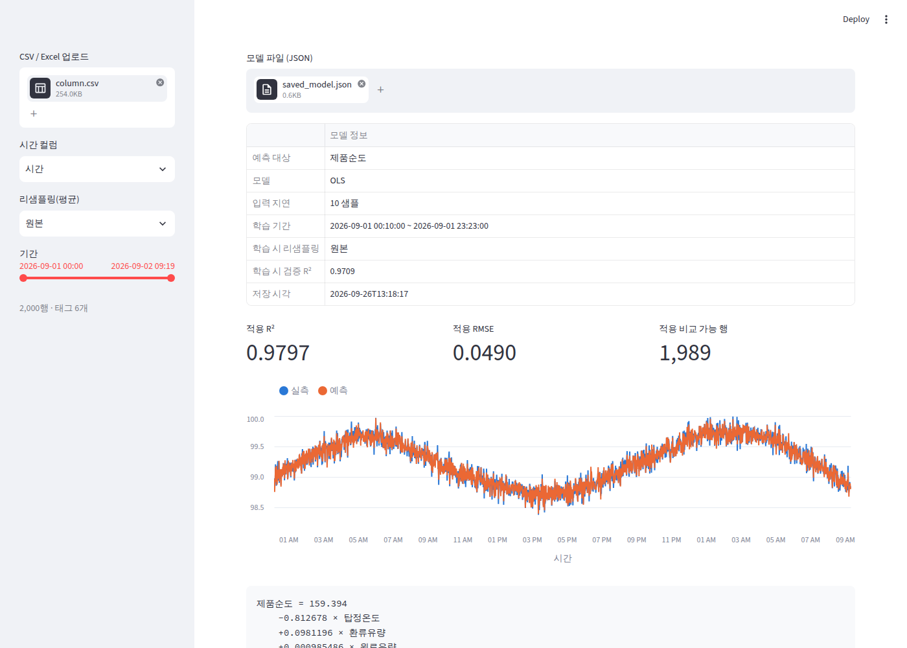

### 7.1 사용 순서

1. 사이드바에서 적용할 **운전데이터 파일**을 올립니다. 모델에 쓰인 입력 태그 이름이 같아야 합니다.
2. 사이드바 **리샘플링**을 모델을 만들 때와 같게 맞춥니다 (다르면 경고가 나옵니다).
3. **모델 적용** 탭에서 **모델 파일 (JSON)** 을 올립니다.
4. 결과 확인
   - **모델 정보**: 예측 대상, 모델 종류, 입력 지연, 학습 기간, 학습 시 리샘플링, 학습 시 검증 R², 저장 시각
   - **적용 R² / 적용 RMSE / 적용 비교 가능 행**: 데이터에 실측값이 있을 때만. 실측과 예측이 모두 있는 행으로 계산합니다
   - **실측 vs 예측 그래프**, **모델식**, **예측 결과 표**, **적용 결과 CSV 다운로드**

### 7.2 결과 판단

| 상황 | 의미 / 조치 |
|---|---|
| 적용 R² ≈ 학습 시 검증 R² | 모델이 그대로 잘 맞음 |
| 적용 R²가 크게 떨어지고, 예측이 실측보다 **항상 한쪽으로 치우침** | 바이어스(편차) 발생. 분석계 교정 변경, 계기 교정, 원료 조성 변화 등. 새 기간 데이터로 다시 학습하세요 (10.14) |
| 적용 R²가 떨어지고 **흩어짐이 커짐** | 운전 조건이 학습 기간 범위를 벗어남 (부하·원료 변경). 새 조건을 포함한 기간으로 다시 학습 |
| 실측값이 없음 | 예측값만 표시됩니다. 분석값이 들어오면 다시 확인하세요 |

---

## 8. 공정단위 탭

여러 설비를 묶은 공정단위(단위공정) 전체를 보는 탭입니다. 하위 탭 5개로 구성됩니다 (v3.1에 **변화점 탐지** 추가, 8.5).

### 8.1 물질·에너지 수지

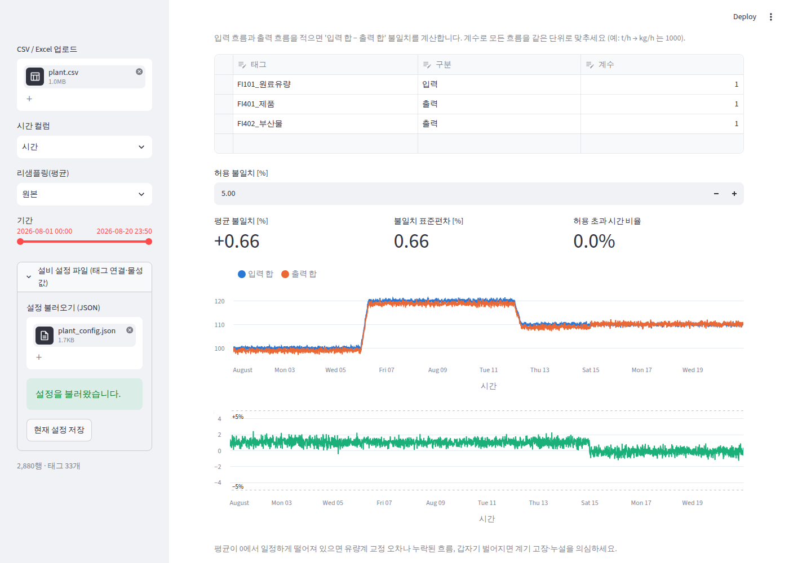

1. 표에 흐름을 한 줄씩 입력합니다: **태그**, **구분**(입력/출력), **계수**.
2. 계수로 모든 흐름을 같은 단위로 맞춥니다 (예: t/h → kg/h 는 1000, 에너지 수지는 각 흐름의 열량 환산 계수).
3. **허용 불일치 [%]** 를 정합니다 (기본 5%).

| 결과 | 의미 |
|---|---|
| 입력 합 / 출력 합 | 두 선이 겹쳐야 정상 |
| 불일치 [%] | (입력 합 − 출력 합) ÷ 입력 합 × 100 |
| 평균 불일치, 표준편차, 허용 초과 시간 비율 | 치우침(교정 오차)과 흔들림(노이즈)을 따로 봄 |

> 예: 샘플 데이터에서 부산물 유량계가 8/15부터 3% 크게 읽도록 만들었더니, 불일치가 그날부터 약 +1%에서 −0.2% 근처로 **계단처럼** 바뀝니다. 이런 계단 변화는 계기 교정·고장의 전형적인 신호입니다.

### 8.2 원단위

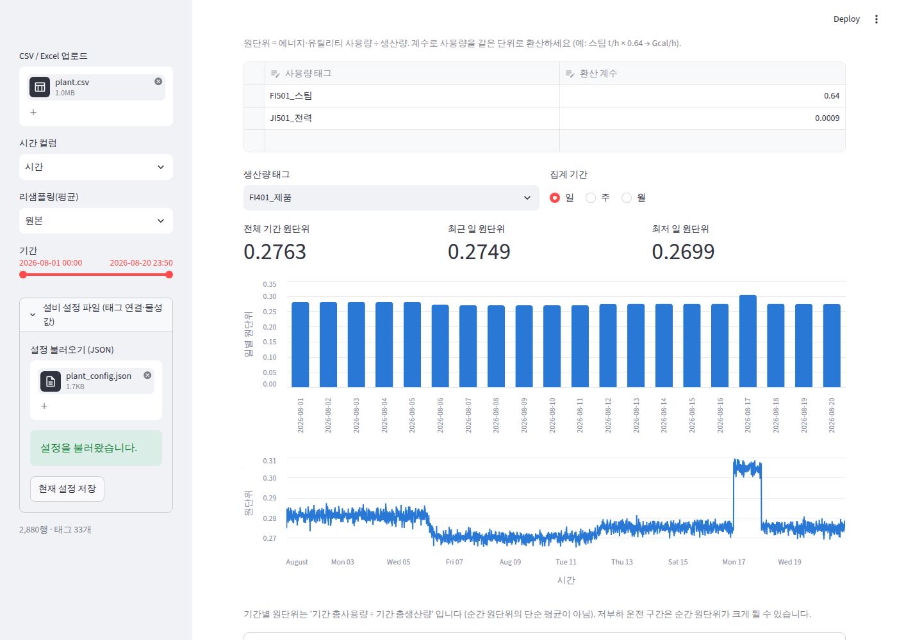

1. 표에 사용량 태그와 **환산 계수**를 입력합니다 (예: 스팀 t/h × 0.64 → Gcal/h, 전력 kW × 0.00086 → Gcal/h). 여러 줄이면 합산됩니다.
2. **생산량 태그** 와 **집계 기간**(일/주/월)을 고릅니다.

| 결과 | 의미 |
|---|---|
| 기간별 원단위 막대 | 기간 총사용량 ÷ 기간 총생산량 (10.18) |
| 순간 원단위 추세 | 매 시점의 사용량 ÷ 생산량 |
| 전체 기간 / 최근 / 최저 원단위 | 목표 관리·개선 효과 비교용 |

> 예: 샘플 데이터에서 8/17 하루 동안 스팀을 3 t/h 더 쓰도록(누설) 만들었더니, 그날 원단위 막대만 튀어 오릅니다.

### 8.3 정상상태 구간

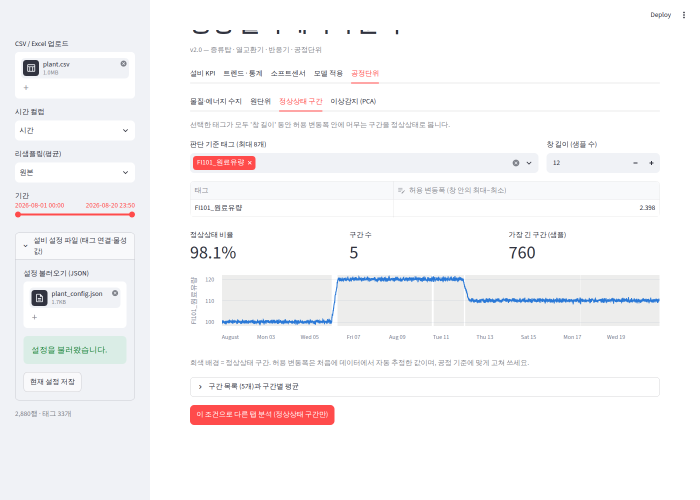

1. **판단 기준 태그** 를 고릅니다 (예: 원료 유량, 핵심 온도·압력. 최대 20개, v3.0까지는 8개).
2. **창 길이 (샘플 수)** 를 정합니다. 공정이 안정되었다고 보려면 최소 이 시간 동안 흔들림이 작아야 합니다.
3. 표의 **허용 변동폭** 을 확인·수정합니다. 창 안의 (최대 − 최소)가 이 값 이하이면 안정으로 봅니다. 처음 값은 데이터에서 자동 추정한 값입니다.

| 결과 | 의미 |
|---|---|
| 회색 배경 | 정상상태 구간 |
| 정상상태 비율, 구간 수, 가장 긴 구간 | 운전 안정도 요약 |
| 구간 목록과 구간별 평균 | 구간마다 태그 평균 (운전 조건별 성능 비교에 사용) |

**이 조건으로 다른 탭 분석 (정상상태 구간만)** 을 누르면 트렌드·통계, 소프트센서, 모델 적용 탭이 정상상태 구간만으로 계산됩니다.
- 비정상 구간은 지우지 않고 **빈 값**으로 바꾸므로, 소프트센서의 입력 지연(샘플 수)은 원래 시간 간격대로 유지됩니다.
- 해제: 같은 화면의 **정상상태 필터 해제**.
- 설비 KPI 탭과 공정단위 탭은 필터와 관계없이 전체 데이터를 사용합니다.

### 8.4 이상감지 (PCA)

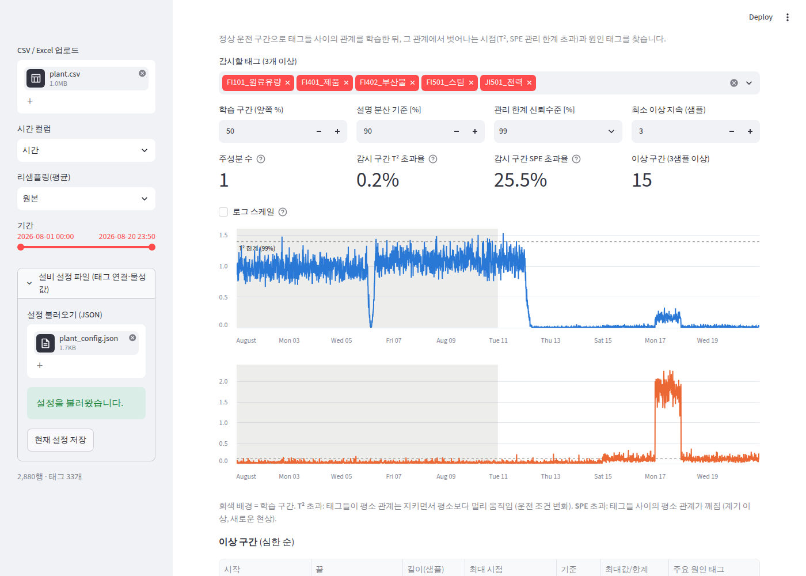

| 설정 | 설명 |
|---|---|
| 감시할 태그 | 3개 이상. 같이 움직이는 공정 변수들을 넣으세요 (유량·온도·압력·KPI) |
| 학습 구간 (앞쪽 %) | 이 구간을 "정상"으로 보고 태그들 사이의 관계를 학습 (기본 50%) |
| 설명 분산 기준 [%] | 주성분 수를 정하는 기준 (기본 90%) |
| 관리 한계 신뢰수준 [%] | 99% = 정상일 때도 약 1% 시점은 한계를 넘음 |
| 최소 이상 지속 (샘플) | 이보다 짧은 초과는 이상 구간으로 세지 않음 (순간 노이즈 제거) |
| 학습 구간 중 정상상태 구간만 학습에 사용 | 8.3의 조건을 적용했을 때만 보임. 과도 운전을 학습에서 제외 |

**결과 읽기**

- **T² 차트**: 태그들이 평소 관계는 지키면서 평소보다 **멀리** 움직임 (운전 조건 변화, 부하 변경).
- **SPE 차트**: 태그들 사이의 **평소 관계가 깨짐** (계기 이상, 누설, 새로운 현상). 대부분의 이상은 여기서 먼저 보입니다.
- 회색 배경 = 학습 구간, 점선 = 관리 한계.

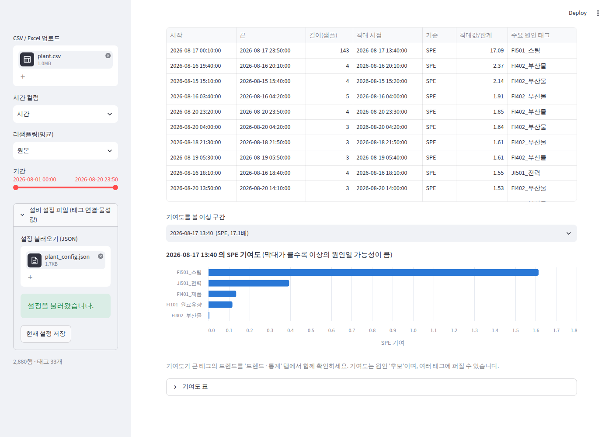

- **이상 구간 표**: 한계를 넘은 구간을 심한 순서로 보여 줍니다. **최대값/한계**는 한계 대비 몇 배인지, **주요 원인 태그**는 그 순간 기여도가 가장 큰 태그입니다.
- **기여도 차트**: 선택한 이상 구간의 가장 심한 시점에서 태그별 기여도. 막대가 큰 태그부터 트렌드를 확인하세요.

> 예: 샘플 데이터에서 8/17 스팀 누설은 SPE 한계의 **17배**, 원인 태그 **FI501_스팀**으로, 8/15 이후 부산물 유량계 오차는 여러 개의 작은 이상 구간과 원인 태그 **FI402_부산물**로 찾아냅니다.

### 8.5 변화점 탐지 (v3.1)

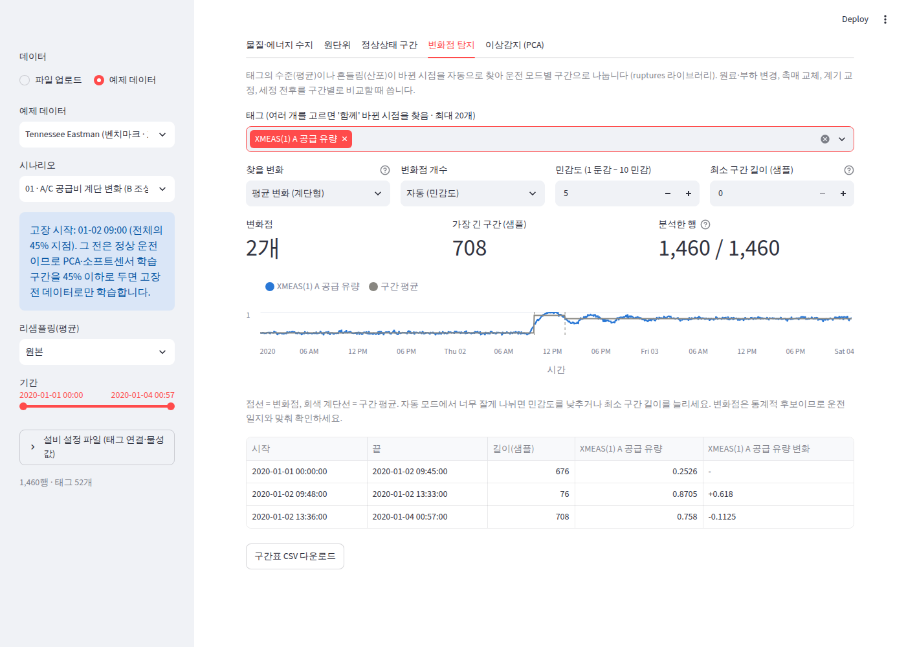

태그의 **수준(평균)이나 흔들림(산포)이 바뀐 시점**을 자동으로 찾아 운전 모드별 구간으로 나눕니다 (ruptures 라이브러리, 10.33). 원료·부하 변경, 촉매 교체, 계기 교정, 세정 전후를 구간별로 비교할 때 씁니다.

| 설정 | 설명 |
|---|---|
| **태그** | 최대 20개. 여러 개를 고르면 **함께** 바뀐 시점을 찾습니다 |
| **찾을 변화** | **평균 변화 (계단형)**: 운전점이 계단처럼 바뀜 (기본). **평균·산포 변화**: 흔들림이 커지거나 줄어든 것도 찾음 (제어 불안정, 계기 노이즈). **분포 변화**: 모양과 관계없이 달라진 곳 (느림) |
| **변화점 개수** | **자동 (민감도)**: 1(둔감) ~ 10(민감), 기본 5. **직접 지정**: 찾을 개수를 정함 |
| **최소 구간 길이 (샘플)** | 이보다 짧은 구간은 만들지 않음. 0 = 자동 (전체의 2%) |

| 결과 | 의미 |
|---|---|
| 변화점 수, 가장 긴 구간, 분석한 행 | 선택한 태그가 모두 값을 가진 행만 씁니다 |
| 태그별 그래프 | 점선 = 변화점, 회색 계단선 = 구간 평균 |
| 구간표 | 구간별 시작·끝·길이·태그 평균과 **이전 구간 대비 변화량**. CSV 다운로드 |

- 너무 잘게 나뉘면 민감도를 낮추거나 최소 구간 길이를 늘리세요. 자동 모드는 공정 데이터 특유의 느린 요동(자기상관)을 잡음으로 보정해서, 정상 운전의 흔들림을 변화로 잘못 잡지 않도록 되어 있습니다.
- 변화점은 **통계적 후보**입니다. 운전 일지·작업 기록과 맞춰 확인하세요.

> 예: Tennessee Eastman 고장 1(A/C 공급비 계단 변화, 01-02 09:00 시작)에서 `XMEAS(1) A 공급 유량` 을 고르면 기본 설정으로 변화점 2개(09:48, 13:36)를 찾습니다 — 고장 직후의 급변과 제어로 새 운전점에 자리 잡은 시점입니다. 고장 없는 정상 운전(00)에서는 같은 설정으로 변화점이 0개입니다. 고장 4(냉각수 입구 온도 계단 변화)에서는 반응기 냉각수 유량의 변화점을 정확히 09:00에 찾습니다.

---

## 9. 데이터 보안

### 9.1 올린 운전데이터는 어디로 가나요?

**`streamlit run app.py` 를 실행한 그 PC 안에서만 처리됩니다.** 인터넷이나 외부 서버로 보내지 않습니다.

```
[내 브라우저] ──(파일 전송)──▶ [streamlit run 을 실행한 PC의 프로그램 메모리]
                                       │
                                       └─ 외부로 나가는 전송 없음
```

| 항목 | 실제 동작 |
|---|---|
| 업로드한 파일 | 프로그램 **메모리에만** 보관. 디스크에 저장하지 않습니다. 브라우저 탭(세션)마다 따로 보관하며, 파일을 X로 지우거나 탭을 닫으면 삭제됩니다 |
| 분석용 임시 결과 (파일 해석 결과) | 역시 **메모리에만** 보관. 최근 파일 3개까지, 최대 **1시간** 지나면 삭제. 프로그램을 끄면(`Ctrl + C`) 모두 사라집니다 |
| 다른 사람이 내 데이터를 볼 수 있나 | 세션(탭)이 서로 분리되어 있어 볼 수 없습니다. 임시 결과는 파일 **내용** 기준으로 구분되므로, 똑같은 파일을 가진 사람만 같은 결과에 접근합니다 |
| 사용 통계 | Streamlit은 원래 익명 사용 통계를 Streamlit 회사로 보냅니다 (데이터 내용은 포함하지 않음). 이 프로그램은 `.streamlit/config.toml` 에서 **꺼 두었습니다** |
| 그래프 | 그래프 그리기에 필요한 값은 **내 브라우저**로 보내져 화면에 그려집니다. 외부 그래프 서비스를 쓰지 않습니다 |
| 예제 데이터 – BibMon (TE, Petrobras) | 프로그램과 함께 설치된 파일을 읽을 뿐 **인터넷을 쓰지 않습니다** |
| 예제 데이터 – chelo (CSTR, 발전소) | **내려받기 버튼을 누를 때만** 인터넷에서 데이터를 **받아옵니다** (보내는 데이터 없음). `~/.chelo` 폴더에 저장되며, chelo를 처음 쓸 때 `~/.chelo/chelo.json` 설정 파일이 생깁니다 |
| ML 모델 | PC 메모리에서만 학습·계산하며 파일로 저장하지 않습니다 |
| AI(Claude) | 프로그램은 AI나 외부 API를 **호출하지 않습니다.** 개발할 때도 가상의 샘플 데이터만 사용했습니다 |

> 확인 방법: 개발 중 브라우저가 보내는 모든 요청을 기록해 검사했고, `localhost` 외의 주소로 나간 요청은 **0건**이었습니다. 서버도 `localhost` 에서만 접속을 받는 것을 확인했습니다.

### 9.2 내가 내려받은 파일

| 파일 | 내용 | 관리 |
|---|---|---|
| 예측 결과 CSV (`softsensor_*.csv`, `applied_*.csv`) | 시간별 실측·예측값 (운전데이터 일부) | 원본 운전데이터와 같은 등급으로 관리 |
| 모델 파일 (`softsensor_*.json`) | 태그 이름, 계수, 학습 기간, 성능 (운전데이터 자체는 없음) | 공정 노하우 → 대외비로 관리 |
| 설비 설정 파일 (`equipment_config*.json`) | 태그 이름, 단위, 물성값, 전열 면적·운전 한계 등 설비 사양 (운전데이터 자체는 없음) | 설비 사양 정보 → 대외비로 관리 |
| 상관분석·변화점 CSV (`correlation_matrix.csv`, `correlation_pairs.csv`, `change_points.csv`) (v3.1) | 변수 사이 상관계수, 구간별 평균 (운전데이터를 요약한 값) | 운전데이터와 같은 등급으로 관리 |

- 다운로드 폴더에 쌓이므로 필요 없는 파일은 지우고, 회사 문서 보안 정책(DRM 등)을 따르세요.
- **모델 파일·설비 설정 파일을 불러올 때 안전성**: 두 파일 모두 순수한 텍스트(JSON)이며, 프로그램은 숫자·이름만 읽습니다. 파일 안에 무엇이 들어 있어도 **코드로 실행되지 않습니다.** 형식이 맞지 않으면 "손상되었습니다" 오류를 내고 거부합니다.

### 9.3 동료와 같이 쓰려면 (네트워크 공개)

기본값은 **이 PC에서만** 접속할 수 있습니다. 같은 사내망의 동료가 쓰게 하려면:

```bash
streamlit run app.py --server.address 0.0.0.0
```

이때 알아둘 점:

- **로그인 기능이 없습니다.** 주소(`http://<내 PC IP>:8501`)를 아는 같은 네트워크의 누구나 접속할 수 있습니다.
- 통신이 **암호화되지 않습니다(HTTP).** 반드시 사내망 안에서만 쓰고, 인터넷에 공개하지 마세요.
- 더 안전하게 쓰려면 IT 부서와 협의해 방화벽으로 접속 PC를 제한하거나, HTTPS(Streamlit `server.sslCertFile` / `server.sslKeyFile` 설정 또는 사내 리버스 프록시)를 적용하세요.
- 동료가 올린 데이터도 **내 PC 메모리**에서 처리됩니다. 내 PC를 끄면 모두 사라집니다.

### 9.4 Git/GitHub 저장소

- 이 프로그램의 소스 코드는 GitHub 저장소에 있습니다. **운전데이터나 모델 파일을 저장소에 올리지 마세요.**
- 실수를 막기 위해 `.gitignore` 에 `*.csv`, `*.xlsx`, `*.xls`, `softsensor_*.json`, `applied_*.csv`, `equipment_config*.json` 을 등록해 두었습니다. 이 파일들은 `git add .` 을 해도 올라가지 않습니다.
- 개발할 때 사용한 샘플 데이터(가상 증류탑·공정 데이터)도 저장소에 넣지 않았습니다.

### 9.5 설치할 때의 인터넷 사용

- `pip install -r requirements.txt` 는 인터넷(PyPI)에서 라이브러리를 내려받습니다 (v3부터 BibMon·chelo 포함, 버전 고정). 운전데이터와는 무관합니다.
- 인터넷이 막힌 공장망(폐쇄망) PC라면, 인터넷 되는 PC에서 `pip download -r requirements.txt -d pkgs` 로 받아 옮긴 뒤 `pip install --no-index --find-links pkgs -r requirements.txt` 로 설치하세요.

### 9.6 보안 점검 목록

- [ ] `.streamlit/config.toml` 이 프로그램 폴더에 있다 (localhost 전용, 사용 통계 끔)
- [ ] 동료와 공유할 때는 사내망에서만, 필요 시 IT 부서와 방화벽·HTTPS 협의
- [ ] 다운로드한 CSV·모델 파일·설비 설정 파일을 회사 정책에 맞게 보관·삭제
- [ ] 운전데이터·모델 파일·설비 설정 파일을 GitHub 등 외부 저장소나 외부 AI 채팅에 올리지 않는다
- [ ] 다 쓰면 `Ctrl + C` 로 프로그램 종료 (메모리의 데이터 삭제)
- [ ] Kaggle 토큰을 쓴다면 본인 PC에만 두기 (9.7)


### 9.7 Kaggle 인증 (chelo 발전소 데이터)

석탄화력 발전소 데이터는 Kaggle에서 받으므로 **본인의 Kaggle 계정 API 토큰**이 필요합니다. 프로그램 화면에는 입력란이 없습니다(토큰이 화면·설정 파일에 남지 않도록).

1. kaggle.com → 계정 설정(Settings) → **API → Create New Token** → `kaggle.json` 을 내려받습니다.
2. 파일을 `~/.kaggle/kaggle.json` (Windows: `C:\Users\<사용자>\.kaggle\kaggle.json`)에 두거나, 환경 변수 `KAGGLE_USERNAME`, `KAGGLE_KEY` 를 설정합니다.
3. 프로그램을 다시 시작하고 **내려받기** 를 누릅니다.

- 토큰은 계정 비밀번호와 같은 수준으로 관리하세요. 공용 PC·공유 서버에는 두지 마세요.
- 회사망에서 kaggle.com 이 막혀 있으면 "내려받지 못했습니다" 오류가 납니다. 이 데이터는 연습용이므로 없어도 다른 기능에는 영향이 없습니다.

---

## 10. 기능별 기초 지식

10.1~10.14는 v1 기능, 10.15~10.21은 v2(설비 KPI·공정단위), 10.22~10.26은 v3(ML·예제 데이터), 10.27~10.35는 v3.1(상관분석·변화점·시간 없는 데이터·운전 구간별 비교) 기능입니다. 각 기능이 **무엇인지, 언제 쓰는지, 어떻게 쓰는지, 어떤 경우에 강하고 어떤 경우에 약한지** 정리했습니다.

### 10.1 리샘플링 (평균)

- **무엇**: 일정 간격(1분, 10분, 1시간 …)마다 값을 평균 내어 데이터 간격을 맞추고 줄이는 것.
- **언제**: 데이터가 1초~수초 간격이라 너무 많을 때, 계기 노이즈가 심할 때, 하루 몇 번 들어오는 분석값과 시간 간격을 맞추고 싶을 때.
- **어떻게**: 보고 싶은 현상보다 **충분히 짧은** 간격을 고르세요. 증류탑 조성 응답(수십 분~수 시간)을 볼 때는 1~10분이 무난합니다.
- **강한 경우**: 노이즈 제거, 속도 향상, 서로 다른 주기의 데이터를 맞출 때.
- **약한 경우·주의**: 간격이 길면 짧은 이상(순간 트립, 스파이크)이 평균에 묻힙니다. 입력 지연(샘플 수)의 **시간 길이가 간격에 따라 바뀝니다** (1분 기준 10샘플 = 10분, 10분 기준 10샘플 = 100분). 모델을 적용할 때도 같은 간격을 써야 합니다.

### 10.2 기간 선택

- **무엇**: 분석에 쓸 시작~끝 시각을 정하는 것.
- **언제**: 정기보수, 스타트업·셧다운, 트립, 계기 고장 구간을 **빼고** 정상 운전만 보고 싶을 때. 특정 이벤트 전후를 확대해 볼 때.
- **강한 경우**: 비정상 구간이 모델 학습을 망치는 것을 막습니다. 소프트센서는 "정상 운전 범위"를 배우는 것이므로 기간 선택이 성능에 가장 큰 영향을 줍니다.
- **주의**: 기간을 너무 좁히면 운전 조건의 다양성이 줄어, 조건이 바뀌면 맞지 않는 모델이 됩니다. 여러 부하·계절이 들어가도록 잡는 것이 좋습니다.

### 10.3 트렌드 보기 (겹쳐 보기 / 태그별 분리 / 정규화)

- **무엇**: 시간에 따른 태그 값 변화를 보는 기본 그래프.
- **언제·어떻게**
  - **겹쳐 보기**: 단위가 같은 태그끼리 (예: 단별 온도 프로파일 변화, 환류량 vs 유출량).
  - **태그별 분리**: 단위가 다른 태그의 **실제 값**을 각자 축으로 (예: 환류량(m³/h)이 바뀐 뒤 탑정온도(℃)가 언제 반응하는지).
  - **정규화(z-score)**: 단위가 다른 태그의 **변동 모양**을 한 축에서 비교 (누가 먼저 움직이고 누가 따라가는지).
- **강한 경우**: 원인→결과 순서, 응답 지연, 주기적 변동(제어 루프 헌팅), 계기 이상(값 고착, 계단 변화)을 눈으로 빠르게 찾을 때.
- **주의**: 정규화는 **절대값 정보가 사라집니다.** "크게 변했다"는 표준편차 기준으로 상대적이므로, 원래 변동이 아주 작은 태그도 크게 보일 수 있습니다.

### 10.4 기초통계

- **무엇**: 개수(count), 평균(mean), 표준편차(std), 최소(min), 사분위수(25%/50%/75%), 최대(max).
- **언제**: 데이터를 처음 받았을 때 품질 점검용으로 **가장 먼저** 봅니다.
- **이렇게 읽으세요**
  - **count 가 다른 태그보다 적음** → 결측(Bad 값, 통신 끊김) 많음.
  - **std 가 0 또는 매우 작음** → 계기 고착, 통신 두절로 값이 멈춤, 또는 수동 입력값. 모델 입력에서 빼는 것이 좋습니다.
  - **min/max 가 계기 범위 끝 값** (예: 0 또는 100%) → 계기 범위 초과(포화) 구간이 있음.
  - **평균과 중앙값(50%)이 크게 다름** → 이상치나 운전 모드가 섞여 있음.
- **강한 경우**: 계기 문제를 분석 전에 빠르게 걸러낼 때.

### 10.5 상관계수 (히트맵)

- **무엇**: 두 태그가 **직선적으로 같이 움직이는 정도** (−1 ~ 1). 피어슨 상관계수.
- **언제**: 소프트센서 입력 후보를 고를 때, 중복된(서로 거의 같은) 태그를 찾을 때, 공정 관계를 대략 파악할 때.
- **어떻게**: 예측 대상과 |r| 이 큰 태그 → 입력 후보. 입력 후보끼리 |r| ≥ 0.9 → 정보가 겹침 → PLS를 쓰거나 하나만 사용.
- **강한 경우**: 태그 수십 개 중 관련 있는 것을 빠르게 추릴 때.
- **약한 경우·주의**
  - **시간 지연을 반영하지 않습니다.** 환류량 변화가 30분 뒤 순도에 나타나면, 같은 시각끼리 비교하는 상관계수는 작게 나옵니다. → 소프트센서의 지연 탐색(10.10)으로 확인하세요.
  - **제어 루프가 관계를 가립니다.** 예: 탑정온도를 PID로 일정하게 제어하면, 온도가 순도에 큰 영향을 주더라도 온도가 거의 안 움직여서 상관이 작게 나옵니다. 이때는 조작 변수(환류량 등)의 상관을 보세요.
  - **상관 ≠ 인과.** 원료 유량이 두 태그를 같이 움직이면 두 태그끼리 상관이 크게 나오지만 서로 원인은 아닙니다.
  - 곡선 관계(비선형)는 상관이 작게 나올 수 있습니다.
  - v3.1 **상관분석** 탭이 위의 약점을 보완합니다: 곡선 관계 판별(10.28), 시간 지연(10.31), 공통 원인 제거(편상관, 10.27), 자기상관 보정 p값(10.27).

### 10.6 소프트센서란

- **무엇**: 자주·싸게 측정되는 값(온도, 압력, 유량)으로 드물게·비싸게 측정되는 품질(순도, 조성)을 **실시간으로 추정**하는 모델. "추론 센서(inferential sensor)"라고도 합니다.
- **언제**
  - 온라인 분석계(GC)가 없거나, 분석 주기가 길거나(수십 분), 자주 고장 날 때.
  - 실험실 분석이 하루 몇 번뿐일 때 그 사이를 메우고 싶을 때.
  - 분석계 값을 교차 검증(분석계 이상 감지)하고 싶을 때.
- **증류탑에서 강한 경우**: 조성과 **민감단 온도**의 관계는 물리적으로 강합니다 (같은 압력에서 끓는점은 조성으로 정해짐). 그래서 온도 + **압력** + 유량 조합으로 순도를 꽤 정확히 추정할 수 있습니다.
- **팁**
  - 온도는 압력에 따라 달라지므로 **탑압력을 입력에 꼭 넣으세요** (또는 압력 보정 온도 PCT 사용).
  - 고순도 제품(99.9% 이상)은 순도 대신 **불순물 농도의 로그값**이 온도와 더 직선 관계입니다. 필요하면 Excel에서 `LOG(불순물)` 컬럼을 만들어 예측 대상으로 쓰세요.
- **약한 경우**: 학습 기간에 없던 운전 조건(새 원료, 큰 부하 변경, 스타트업), 계기 교정 변경, 탑 내부 상태 변화(파울링, 단 효율 저하).

### 10.7 학습 / 검증 분할

- **무엇**: 앞쪽 시간 구간으로 모델을 만들고(학습), 뒤쪽 구간으로 **처음 보는 데이터**처럼 성능을 확인(검증)하는 것.
- **왜 시간 순서인가**: 공정 데이터는 1분 전과 지금이 거의 같습니다. 무작위로 섞으면 검증 데이터의 "바로 옆" 데이터로 학습하게 되어 성능이 실제보다 좋게 보입니다.
- **어떻게**: 기본 70%. 검증 구간에도 운전 변화가 조금은 있어야 의미 있는 평가가 됩니다. 검증 구간이 평탄하면 R²가 낮게 나올 수 있으니(10.11) RMSE도 같이 보세요.
- **강한 경우**: "이 모델을 다음 달에 써도 될까?"를 미리 가늠할 수 있습니다.

### 10.8 OLS (선형회귀)

- **무엇**: 예측 = 절편 + Σ(계수 × 입력). 오차 제곱합이 가장 작도록 계수를 정합니다.
- **언제**: 입력이 몇 개(2~5개)이고 서로 독립적일 때. 결과를 설명하기 가장 쉬운 모델.
- **강한 경우**: 입력이 서로 다른 정보를 줄 때(예: 탑정온도, 환류비, 압력). 계수를 공정 원리와 비교하기 쉽습니다.
- **약한 경우**: 입력끼리 상관이 강하면(인접 단 온도들, 이중화 계기) 계수가 크게 튀거나 부호가 뒤집혀 **새 데이터에서 크게 틀립니다.** 입력이 많고 데이터가 적을 때도 과적합됩니다.

### 10.9 PLS (부분최소제곱) 와 성분 수

- **무엇**: 입력들을 **예측 대상과 관련이 큰 방향**으로 몇 개의 "성분(잠재 변수)"으로 압축한 뒤 회귀하는 방법. 화학공정 소프트센서에서 가장 널리 쓰이는 방법 중 하나입니다.
- **언제**: 단별 온도처럼 비슷한 입력이 여러 개일 때, 입력이 많을 때(10개 이상), 이중화 센서가 있을 때.
- **어떻게**: 성분 수는 **성분 수별 검증 R²** 표에서 R²가 더 이상 크게 오르지 않는 가장 작은 수를 고르세요.
- **강한 경우**: 서로 비슷한 온도 여러 개를 모두 넣어도 안정적입니다. 한 센서가 조금 틀어져도 다른 센서들이 보완합니다.
- **약한 경우**: 성분이 너무 많으면 OLS처럼 불안정해지고, 너무 적으면 정보가 부족합니다. 여전히 **선형** 모델입니다.

### 10.10 입력 지연과 자동 탐색

- **무엇**: 입력 변화가 품질에 나타나기까지의 시간(공정 **dead time**) + 분석계의 샘플링·분석 시간. 입력을 그만큼 **과거 값**으로 당겨서 짝을 맞춥니다.
- **언제**: 거의 항상. 증류탑은 단 수, 체류 시간, 분석계 주기 때문에 수 분~수십 분 지연이 흔합니다.
- **어떻게**: **최적 지연 자동 탐색**으로 0~최대 지연까지 모두 모델을 만들어 검증 R²가 가장 높은 지연을 찾습니다. 최대 지연은 예상 지연의 2배 정도로 넉넉히.
- **강한 경우**: 그래프에 **뚜렷한 봉우리**가 있으면 그 지연이 실제 공정 지연일 가능성이 높습니다. 분석계 주기를 알고 있다면 서로 비교해 보세요.
- **약한 경우·주의**
  - 이 프로그램은 **모든 입력에 같은 지연**을 적용합니다. 탑정온도는 빠르고 원료 유량은 느린 것처럼 입력마다 지연이 크게 다르면 정확도가 떨어집니다. 이때는 지연이 비슷한 입력끼리 모델을 만들어 보세요.
  - 그래프가 평평하면 지연의 영향이 작거나, 데이터 변동이 적어 구분이 안 되는 것입니다.

### 10.11 R² 와 RMSE

- **R² (결정계수)**: 품질 변동 중 모델이 설명하는 비율. 1 = 완벽, 0 = 평균값만 찍는 수준, 음수 = 평균값보다도 나쁨.
- **RMSE (평균 제곱근 오차)**: 예측 오차의 크기. **품질과 같은 단위**(예: %)입니다.
- **어떻게 같이 보나**
  - R²는 **기간 중 품질이 얼마나 변했는지**에 따라 달라집니다. 품질이 거의 일정한 기간이면 오차가 작아도 R²가 낮게 나옵니다. → 이럴 때는 RMSE로 판단하세요.
  - RMSE는 **분석계 재현성(정밀도)** 과 비교하세요. RMSE가 분석계 오차 수준이면 더 좋아지기 어렵습니다.
  - 학습 R² ≫ 검증 R² 이면 과적합 또는 운전 조건 변화.

### 10.12 변수 영향도 (표준화 계수 / 원래 단위 계수)

- **표준화 계수**: 입력을 1 표준편차 바꿨을 때 예측 변화. 단위와 상관없이 **어느 입력이 더 중요한지** 비교할 때.
- **원래 단위 계수**: 입력을 원래 단위로 1 바꿨을 때 예측 변화 (예: 탑정온도 1℃ ↑ → 순도 0.8% ↓). **공정 원리 확인과 DCS 적용**에 씁니다.
- **꼭 해볼 것 – 부호 점검**: 계수의 부호가 공정 원리와 맞는지 확인하세요.
  - 예: 탑정 제품 순도에 대해 탑정온도 ↑ → 무거운 성분이 올라옴 → 순도 ↓ (음수가 정상). 환류량 ↑ → 분리 ↑ → 순도 ↑ (양수가 정상).
  - 부호가 반대면 입력끼리 상관(→ PLS 사용), 제어 루프 영향, 데이터 기간 문제를 의심하세요. 부호가 이상한 모델은 R²가 높아도 운전 조건이 바뀌면 틀리기 쉽습니다.

### 10.13 패리티 플롯

- **무엇**: 가로 = 실측, 세로 = 예측. 완벽하면 모든 점이 대각선 위에 있습니다.
- **이렇게 읽으세요**
  - **대각선 위/아래로 평행하게 치우침** → 바이어스(일정한 편차). 분석계 교정, 계기 오프셋 변화 의심.
  - **기울기가 대각선보다 완만** → 모델이 변동을 작게 예측(극단값에서 과소 추정). 중요한 입력 누락 가능성.
  - **점들이 몇 개 덩어리로 나뉨** → 운전 모드(부하, 원료 등급)가 섞여 있음. 모드별로 모델을 만드는 것이 나을 수 있습니다.
  - **검증(주황) 점만 따로 벗어남** → 학습 기간과 검증 기간의 운전 조건이 다름.
- **강한 경우**: 시간 그래프에서는 잘 안 보이는 **편향과 범위별 오차**를 한눈에 봅니다.

### 10.14 모델식 · 모델 저장 · 모델 적용

- **모델식**: 절편 + Σ(계수 × 입력(t − 지연)). DCS 계산 블록(가감산·곱셈 블록 + 지연(dead time) 블록)이나 Excel로 그대로 구현할 수 있습니다.
- **모델 저장**: 모델식과 함께 **어떤 조건으로 만들었는지**(지연, 리샘플링, 학습 기간, 성능)를 기록합니다. 모델 이력 관리용으로 파일 이름에 날짜를 붙여 보관하세요 (예: `softsensor_제품순도_2026-09.json`).
- **모델 적용**: 새 데이터에서 성능이 유지되는지 **정기적으로(예: 월 1회)** 확인하세요.
- **모델이 틀어지는 이유 (모델 드리프트)**: 원료 조성 변화, 분석계·계기 교정 변경, 파울링·단 효율 저하, 운전 목표 변경.
- **틀어졌을 때 대처**
  - 예측이 실측보다 **일정하게 치우침**(바이어스) → 현장에서는 최근 분석값과 예측의 차이만큼 **절편을 보정**하는 방법(바이어스 업데이트)을 많이 씁니다.
  - 흩어짐이 커짐 → 최근 기간 데이터를 포함해 **다시 학습**하세요.
- **주의**: 모델은 학습한 **운전 범위 안에서만** 믿을 수 있습니다. 범위를 벗어난 조건(스타트업, 새 원료)에서의 예측은 참고만 하세요.


### 10.15 열교환기 성능 지표 (전열량 · LMTD · U · 파울링 저항 · 열수지)

- **무엇**: 열교환기가 열을 얼마나 잘 전달하는지. **U(총괄전열계수)** 는 온도차 1℃, 면적 1 m²당 전달되는 열량이고, 표면이 오염(파울링)되면 떨어집니다. **파울링 저항**은 오염이 더한 열저항입니다.
- **언제**: 냉각기·가열기·열회수 교환기의 **세정 시기 결정**, 성능 저하 원인 분석(오염인지 유량 부족인지), 세정 효과 확인.
- **어떻게**: 운전 조건이 바뀌면 전열량과 온도는 따라 변하지만 U는 표면 상태에 주로 좌우되므로, **U와 파울링 저항의 추세**를 봅니다. 세정 기준(파울링 한계)을 넣어 도달 예상일을 확인하세요.
- **강한 경우**: 양쪽 모두 액체 현열(온도 변화만 있는) 교환, 유량이 안정적이고 온도차가 충분히 클 때(ΔT 수 ℃ 이상).
- **약한 경우·주의**
  - **응축·증발(상변화)** 이 있는 쪽은 m·cp·ΔT로 열량을 계산할 수 없습니다 (스팀 가열기, 응축기). 이때는 상변화가 없는 반대쪽 유량만 연결하세요.
  - 유량이 매우 작거나 온도차가 작으면 U가 크게 흔들립니다. 리샘플링(1h 등)이나 정상상태 필터를 쓰세요.
  - LMTD가 비어 있으면 온도 교차(고온측 출구 < 저온측 입구)이거나 **고온측/저온측 태그를 바꿔 연결**한 경우입니다.
  - **열수지 차이**가 크면 U도 믿을 수 없습니다. 먼저 유량계·온도계·비열 값을 점검하세요.

### 10.16 반응기 성능 지표 (발열 ΔT · WABT · 활성 저하 · EOR · 전환율/선택도/수율)

- **무엇**: **WABT**(가중평균촉매층온도)는 촉매층 전체의 대표 온도입니다. 촉매 활성이 떨어지면 같은 전환율을 유지하려고 온도를 올리게 되므로, **WABT 상승 속도 ≈ 촉매 활성 저하 속도** 입니다. **EOR**은 설비·촉매 한계로 더 이상 온도를 올릴 수 없는 운전 말기입니다.
- **언제**: 촉매 교체·재생 시기 계획, 운전 조건 변경 효과 평가, 핫스팟(국부 과열) 감시.
- **어떻게**: WABT 추세와 EOR 도달 예상일을 보고, 층별 ΔT로 어느 층의 반응이 줄었는지 확인합니다 (앞층 ΔT가 줄고 뒤층 ΔT가 늘면 앞층 활성 저하).
- **강한 경우**: 고정층 반응기(수소처리, 개질 등)에서 **원료 성상과 목표 전환율이 비교적 일정**할 때. 수 주~수 개월 추세에서 가장 유용합니다.
- **약한 경우·주의**
  - 원료가 무거워지거나 처리량·목표 전환율을 올려도 WABT가 오릅니다. 이런 변경 구간을 기간 선택으로 빼거나, 조건이 같은 구간끼리 비교하세요.
  - 전환율·선택도는 **유량과 분율이 같은 기준(몰 또는 질량)** 일 때만 의미가 있습니다. 분석값이 드물면 리샘플링으로 시간 간격을 맞추세요.
  - 열전대 1개로 층 온도를 대표하면 편류(channeling)나 핫스팟을 놓칠 수 있습니다.

### 10.17 물질·에너지 수지

- **무엇**: 들어간 양 = 나온 양 (+ 쌓인 양)이라는 보존 법칙으로 계측값을 점검하는 것.
- **언제**: 유량계 교정 오차·고장 찾기, 누설·손실 추정, 수율 계산 전 데이터 검증.
- **어떻게**: 불일치의 **평균**(일정한 치우침 → 교정 오차, 빠진 흐름)과 **변화 모양**(계단 → 계기 교체·고장, 서서히 → 드리프트, 튐 → 과도 운전)을 봅니다.
- **강한 경우**: 정상 운전에서, 모든 흐름이 측정될 때. 계단 변화는 매우 민감하게 잡힙니다.
- **약한 경우·주의**: 탱크·탑 액위 변화(축적)가 있으면 과도 운전 중 불일치가 생기는 것이 정상입니다 → 정상상태 구간이나 1h 이상 리샘플링으로 보세요. 에너지 수지는 열손실 때문에 몇 % 차이가 나는 것이 보통입니다.

### 10.18 원단위

- **무엇**: 제품 1단위를 만드는 데 드는 에너지·유틸리티. 에너지 효율 관리의 기본 지표.
- **언제**: 월별 목표 관리, 개선(단열, 열회수, 운전 조건 변경) 효과 확인, 이상 사용 발견.
- **어떻게**: 기간별 원단위는 **기간 총사용량 ÷ 기간 총생산량** 입니다. 순간 원단위를 단순 평균하면 저부하 시점의 큰 값이 과하게 반영되므로 이 방식을 씁니다.
- **강한 경우**: 같은 제품·비슷한 부하에서 기간끼리 비교할 때.
- **약한 경우·주의**: 부하가 낮으면 고정 사용량(보온, 펌프 기본 동력) 때문에 원단위가 올라갑니다. 부하가 다른 기간을 비교할 때는 이 점을 감안하세요. 환산 계수(스팀 엔탈피 등)가 틀리면 합산 원단위 전체가 틀립니다.

### 10.19 정상상태 구간 탐지

- **무엇**: 공정 변수가 일정 시간 동안 허용 범위 안에서만 움직이는 구간을 자동으로 찾는 것.
- **언제**: 성능 비교(정상 운전끼리), 소프트센서·PCA 학습 데이터 선별, 성능 시험 구간 찾기.
- **어떻게**: 공정을 대표하는 태그 몇 개(원료 유량, 핵심 온도)를 고르고, 창 길이는 공정 응답 시간(수십 분~수 시간) 정도로, 허용 변동폭은 "이 정도면 안정"이라고 판단하는 값으로 정합니다.
- **강한 경우**: 부하 변경·스타트업이 섞인 긴 데이터에서 비교 가능한 구간만 골라낼 때.
- **약한 경우·주의**: 허용 변동폭이 너무 크면 과도 구간도 정상으로, 너무 작으면 노이즈 때문에 정상 구간이 거의 없게 됩니다. 제어 루프가 흔들리는(헌팅) 공정은 정상 구간이 짧게 나옵니다.

### 10.20 다변량 이상감지 (PCA, T², SPE, 기여도)

- **무엇**: 정상 운전 데이터에서 태그들이 **함께 움직이는 패턴**(주성분)을 학습한 뒤, 새 데이터가 그 패턴에서 얼마나 벗어나는지 두 지표로 봅니다.
  - **T²**: 패턴 안에서 평소보다 먼 곳에 있음 (운전 범위 밖).
  - **SPE**(Q 통계량): 패턴 자체를 벗어남 (관계가 깨짐).
  - **기여도**: 각 태그가 T²·SPE에 얼마나 기여했는지. 원인 태그 **후보**.
- **언제**: 태그가 많아 하나씩 보기 어려운 공정단위 감시, 개별 알람이 울리기 전 초기 이상 발견, 계기 이상(한 태그만 관계가 어긋남) 찾기.
- **어떻게**: 학습 구간에는 **정상이라고 확신하는 기간**을 넣습니다 (정상상태 필터 활용). 새 운전 조건이 정상이면 그 기간도 학습에 포함해 다시 학습합니다.
- **강한 경우**: 서로 연관된 변수가 많은 공정(유량-제품량-유틸리티, 단별 온도). 한 변수만 보면 정상 범위인데 **관계가 이상한** 경우를 잘 잡습니다 (예: 원료는 그대로인데 스팀만 증가 → 누설).
- **약한 경우·주의**
  - 학습 구간에 없던 **정상적인** 운전 조건(새 부하, 새 제품)도 이상으로 나옵니다. 이상 구간이 운전 변경 시점과 겹치는지 먼저 확인하세요.
  - 선형 관계를 가정합니다. 강한 비선형 공정은 운전 영역별로 따로 학습하세요.
  - 기여도는 이상이 퍼지면서(**smearing**) 원인이 아닌 태그에도 나눠질 수 있습니다. 가장 큰 막대부터 트렌드로 확인하세요.

### 10.21 추세선과 도달 예측 (세정 시기 · EOR)

- **무엇**: 전체 기간 데이터에 직선을 맞춰 하루당 변화율을 구하고, 그 직선이 한계값에 닿는 날짜를 계산합니다.
- **언제**: 세정·촉매 교체 일정의 **대략적인** 계획.
- **주의**: 직선 외삽입니다. 파울링은 초기에 빠르다가 느려지거나(점근형) 가속되기도 하고, 촉매 활성 저하도 말기에 빨라지는 경우가 많습니다. 최근 기간만 기간 선택으로 골라 다시 보고, 여러 달의 추세와 비교해 판단하세요. 추세값이 이미 한계를 넘었으면 "이미 넘었습니다", 10년 이상이면 "도달하지 않습니다"로 표시합니다.


### 10.22 ML 소프트센서 (랜덤포레스트 · 그래디언트 부스팅 · 신경망)

- **무엇**
  - **랜덤포레스트**: "조건 → 값" 규칙 나무를 수백 개 만들어 평균.
  - **그래디언트 부스팅**: 앞 나무의 오차를 다음 나무가 고쳐 가며 쌓음.
  - **신경망(MLP)**: 여러 층의 가중합과 비선형 함수. 모두 곡선·문턱·상호작용 관계를 스스로 배웁니다.
- **언제**: 입력과 품질의 관계가 **곡선이거나 운전 영역마다 다를 때** (예: 부하에 따라 효율 곡선이 휘는 경우, 특정 온도 이상에서만 부반응). 선형 모델의 검증 R²가 부족하고, 데이터가 충분할 때(입력 수의 수십 배 이상 행).
- **어떻게**: OLS/PLS와 **같은 입력으로** 비교해 검증 R²가 확실히 나을 때만 쓰세요. 튜닝(10.23)은 모델을 고른 뒤 마지막에.
- **강한 경우**: 비선형 관계, 입력 사이의 상호작용, 문턱 효과. 데이터가 운전 범위를 고루 담고 있을 때.
- **약한 경우·주의**
  - **학습 범위 밖을 예측하지 못합니다.** 특히 나무 모델(랜덤포레스트·부스팅)은 학습 때 본 최댓값보다 큰 값을 절대 예측하지 않습니다. 새 부하·새 원료에서는 선형 모델보다 **더 크게** 틀릴 수 있습니다 (예: TE 고장 1에서 제품 성분이 학습 범위를 벗어나자 랜덤포레스트 검증 R²가 음수로 떨어짐).
  - **과적합**: 학습 R²는 거의 1인데 검증 R²가 낮으면 과적합입니다. 입력을 줄이거나, 데이터를 늘리거나, 튜닝하세요.
  - **설명이 어렵고 DCS에 옮길 수 없습니다** (수식 없음). 현장 적용은 OLS/PLS가 유리합니다.
  - 정상 운전처럼 **변동이 작은** 데이터는 관계가 거의 선형이라 ML의 이득이 없습니다 (TE 정상 운전: OLS 1.000 vs RF 0.9999).

### 10.23 자동 튜닝 (Optuna)

- **무엇**: 나무 개수·깊이·학습률·정규화 강도 같은 **모델 설정값(하이퍼파라미터)** 을 자동으로 여러 번 바꿔 가며, 학습 데이터 안에서 따로 떼어 둔 부분의 오차가 가장 작은 조합을 찾습니다.
- **언제**: ML 모델을 고른 뒤 성능을 조금 더 끌어올리고 싶을 때.
- **어떻게**: 5~20회로 시작하세요. 횟수만큼 시간이 걸립니다. 튜닝 뒤에도 **검증 R²** 로 판단하세요 (튜닝은 학습 구간 안에서만 이루어지므로 검증 구간 성능이 진짜 성능).
- **주의**: 효과는 보통 모델 선택·입력 선택보다 작습니다. 검증 R²가 거의 같다면 튜닝하지 않은 단순한 설정이 더 안정적입니다.

### 10.24 잔차 알람

- **무엇**: 예측값과 실측값의 차이(잔차)가 평소보다 크게 벌어진 시점을 표시합니다. BibMon의 "예측 오차 기반 알람" 개념입니다.
- **한계값**: 모델이 **처음 보는 데이터**에서의 잔차 99% 수준.
  - OLS/PLS는 학습 잔차로 계산해도 거의 같습니다.
  - ML은 학습 데이터에 지나치게 잘 맞아서, 학습 잔차로 한계를 잡으면 정상 데이터에서도 알람이 쏟아집니다. 그래서 학습 구간의 마지막 20%를 떼어 따로 잰 잔차로 한계를 잡습니다.
  - 가상 데이터 검증: 학습 잔차 기준이면 정상 데이터 알람 16.7%, 새 기준이면 1.6%.
- **언제**: 소프트센서를 **분석계 감시**에 쓸 때 (분석계가 고장·드리프트하면 실측이 예측에서 벗어남), 모델이 모르는 운전 변화를 알아챌 때.
- **읽는 법**: 정상이면 검증 구간의 약 1%에 흩어져 나타납니다. **몰려서 연속으로** 나오면 원인을 확인하세요 (분석계 교정, 계기 이상, 새 운전 조건). **잔차 알람 구간** 표에 연속 구간이 정리됩니다.

### 10.25 순열 중요도

- **무엇**: 입력 하나의 값을 무작위로 섞어 그 입력의 정보를 없앴을 때 모델의 R²가 얼마나 떨어지는지. 클수록 모델이 그 입력에 많이 의존합니다.
- **언제**: ML 모델에서 어떤 입력이 중요한지 볼 때 (ML에는 계수가 없음). 효과가 없는 입력을 빼서 모델을 단순하게 만들 때.
- **주의**: 서로 비슷한 입력(예: 인접 단 온도)이 여럿 있으면 하나를 섞어도 다른 입력이 대신하므로 **둘 다 작게** 나올 수 있습니다. 중요도는 "원인"이 아니라 "모델이 쓴 정도"입니다.

### 10.26 벤치마크 데이터 활용 (Tennessee Eastman · Petrobras)

- **무엇**: 답(고장 시작 시점과 종류)이 알려진 공개 데이터. 방법의 성능을 객관적으로 확인할 때 씁니다.
- **언제**: 새 기능을 익힐 때, 우리 공정에 적용하기 전에 설정(학습 구간, 신뢰수준, 최소 지속 샘플)을 연습할 때, 동료 교육.
- **활용 예**
  - 이상감지: TE 고장 1·2·4·6처럼 뚜렷한 고장은 PCA로 거의 모두 잡힙니다 (고장 1: 감시 구간 T² 초과 90.6%, 고장 이후 구간과 거의 일치).
  - 3·9·15번은 **정상과 거의 구별되지 않는 것으로 알려진** 어려운 고장입니다. 어떤 방법으로도 검출률이 낮은 것이 정상이며, 방법의 한계를 체감하는 데 좋습니다.
  - 소프트센서: TE 정상 운전(00)에서 여러 변수를 예측해 보고 선형과 ML 모델을 비교해 보세요.
  - Petrobras 데이터: 결측·범위 초과 문자열("Inp OutRange")·계기 고착이 섞인 실제 데이터라, 기초통계로 데이터 품질을 점검하는 연습에 좋습니다.
- **주의**: 벤치마크의 좋은 결과가 우리 공정의 결과를 보장하지 않습니다. 계측 잡음·운전 모드·결측 패턴이 다릅니다.

### 10.27 상관계수의 종류와 자기상관 보정 p값

- **무엇**
  - **피어슨 r**: 직선 관계의 세기. 가장 흔하지만 이상값 하나에 크게 흔들리고 곡선 관계를 놓칩니다.
  - **스피어만 ρ**: 값 대신 **순위**로 계산한 상관. 한 방향으로 계속 오르거나 내리는(단조) 곡선이면 1에 가깝게 나옵니다 (예: 온도–반응속도의 지수 관계).
  - **켄달 τ**: 역시 순위 기반. 스피어만보다 값이 작게 나오지만 이상값·동점에 더 강합니다. 계산량이 커서 2만 행을 넘으면 고르게 뽑아 계산합니다.
  - **편상관**: 선택한 **나머지 변수들의 영향을 뺀** 두 변수의 직접 관계. 예: 원료 유량이 A와 B를 같이 움직여서 A–B 상관이 크게 나오면, 원료 유량을 함께 선택하고 편상관을 보면 A–B의 '가짜' 상관이 사라집니다.
- **자기상관 보정 p값**: 공정 데이터는 이웃한 시점끼리 거의 같은 값이라 1만 행이라도 서로 독립적인 정보는 수십 개뿐일 수 있습니다. 교재식 p값은 행 수를 그대로 써서 **거의 항상 0.000** 이 나오고, 우연히 같이 드리프트한 두 변수도 "유의"하게 만듭니다. 이 프로그램은 두 변수의 1-시차 자기상관 ρx·ρy로 **유효 n = n × (1 − ρxρy) / (1 + ρxρy)** (Bartlett 보정)을 구해 p값을 계산합니다.
- **언제**: 피어슨 = 기본. 곡선이 의심되면 스피어만과 비교(스피어만이 뚜렷이 크면 단조 곡선). 이상값이 걱정되면 켄달. 여러 변수가 얽힌 공정에서 "진짜 직접 관계"를 찾을 때 편상관.
- **주의**: 편상관은 **선택한 변수만** 통제합니다. 중요한 공통 원인을 선택하지 않으면 걸러지지 않습니다. 유효 n은 AR(1) 근사라서 주기적 변동이 큰 데이터에서는 여전히 낙관적일 수 있습니다.

### 10.28 거리상관과 곡선(비선형) 관계 판별

- **무엇**: **거리상관**은 두 변수가 **어떤 모양으로든** 관련이 있으면 0보다 커지고, 완전히 독립일 때만 0이 되는 지표입니다 (0~1). U자·역U자처럼 피어슨·스피어만이 0 근처로 나오는 관계도 잡습니다. **곡선 설명력 추가**는 X를 10구간으로 나눈 구간 평균(자유 곡선, 상관비 η²)이 직선(r²)보다 더 설명하는 분산 비율입니다.
- **판별 규칙**: 세 지표가 모두 0.3 미만 → 관계 약함. 곡선 설명력 추가 ≥ 0.08 → 곡선 관계 (구간 평균이 한 방향이면 **단조 곡선**, 오르내리면 **비단조**). 그 외 → 직선에 가까움.
- **비단조가 나오는 두 가지 경우**: ① 진짜 U자·역U자 곡선 (예: 기온–전력수요), ② **운전 모드 혼재** — 운전 조건(압력·부하·원료)이 다른 기간이 섞여 산점도가 여러 덩어리로 나뉜 경우. 공정 데이터에서는 ②가 더 흔합니다. 산점도를 시간 색으로 보면 구별됩니다 (덩어리마다 색이 다르면 ②).
- **언제**: 변수가 많을 때 "직선 상관만 보고 놓친 관계"를 찾을 때. 대표 예: 온도–전력(냉방·난방), 부하–효율(최적점이 있는 곡선), 밸브 개도–유량(포화).
- **주의**: 거리상관은 속도를 위해 최대 300행을 고르게 뽑아 계산합니다. 곡선 판정은 후보를 알려 주는 것이므로, **이변량 회귀**에서 산점도와 모델 비교로 확인하세요.

### 10.29 이변량 회귀 (모델 · 신뢰구간 · 예측구간 · 모델 비교)

- **무엇**: 한 변수(X)로 다른 변수(Y)를 설명하는 식을 찾는 것. 모델 6가지:

| 모델 | 식 | 어울리는 관계 |
|---|---|---|
| 선형 | y = a + b·x | 대부분의 좁은 운전 범위 |
| 2차 다항식 | y = a + b·x + c·x² | 최적점이 있는 곡선 (효율, U자) |
| 3차 다항식 | … + d·x³ | S자 등 복잡한 곡선 (범위 밖 외삽 금지) |
| 로그 | y = a + b·ln x | 처음엔 빠르게, 나중엔 천천히 증가 (포화) |
| 지수 | y = a·e^(bx) | 온도–반응속도, 증기압 등 (Y > 0) |
| 거듭제곱 | y = a·x^b | 유량–압력강하(b ≈ 2), 규모 법칙 (X, Y > 0) |

- **신뢰구간 vs 예측구간**: 신뢰구간(짙은 띠)은 "평균적인 Y가 있을 범위", 예측구간(점선)은 "**측정값 하나**가 들어올 범위". 운전 목표나 알람 범위를 정할 때는 **예측구간**을 쓰세요.
- **HAC (Newey-West) 보정**: 잔차가 시간적으로 이어져 있으면 보통의 신뢰구간·p값은 지나치게 좁고 작습니다. HAC는 그 자기상관을 반영해 넓혀 줍니다. 계수 값 자체는 바뀌지 않습니다.
- **모델 고르기**: 모델 비교표의 **조정 R²** 가 가장 높은 모델이 후보지만, 차이가 0.01 미만이면 단순한 모델(선형)이 낫습니다. 다항식은 데이터 범위 밖에서 급격히 틀어집니다.
- **주의**: 이변량 회귀는 **다른 변수의 영향을 무시**합니다. X와 Y가 모두 제3의 변수에 따라 움직이면 기울기가 원인 효과를 뜻하지 않습니다. 여러 입력을 함께 쓰려면 소프트센서(OLS/PLS/ML)를 쓰세요.

### 10.30 잔차 분석

- **무엇**: 잔차(실측 − 모델)를 보고 모델의 가정이 맞는지 확인하는 것. 좋은 모델의 잔차는 **패턴 없는 잡음**이어야 합니다.
- **왜 필요한가**: R²가 높아도 잔차에 곡선·계단·시간 패턴이 남아 있으면, 모델 형태가 틀렸거나 중요한 변수·지연을 빠뜨린 것입니다. 이 경우 계수의 p값·신뢰구간도 믿을 수 없습니다.
- **검정 요약**: Durbin-Watson(1-시차 자기상관, 2 근처가 좋음), Ljung-Box(여러 시차의 자기상관), Breusch-Pagan(등분산), Jarque-Bera(정규성), 이상 잔차 비율, 쿡의 거리(영향점).
- **공정 데이터에서의 현실**: 공정 데이터의 잔차는 거의 항상 자기상관이 있습니다. '주의'가 나왔다고 모델을 버리지 말고, **잔차 시간 그래프**에서 계단(운전 변화)·기울기(드리프트)·몰린 구간(특이 운전)을 먼저 찾으세요. 데이터가 수천 행 이상이면 정규성 검정은 작은 차이에도 '주의'가 나오기 쉬우므로 Q-Q 플롯 모양으로 판단합니다.

### 10.31 시차 상관과 그랜저 선후 관계

- **시차 상관(교차상관, CCF)**: X를 k 샘플 밀어서 Y와 상관을 계산한 것을 k별로 그린 것. 봉우리 위치가 **지연 시간**(체류시간, 수송 지연, 분석계 지연)입니다. 증류탑에서 환류량을 바꾼 뒤 제품 조성이 반응하기까지, 반응기 입구 조성이 바뀐 뒤 출구에 나타나기까지 등.
- **차분을 권장하는 이유**: 두 변수가 모두 천천히 드리프트하면 모든 지연에서 상관이 높아 봉우리가 보이지 않습니다. 변화량끼리 보면 "X가 움직인 뒤 Y가 움직였다"는 순서 정보만 남습니다.
- **그랜저 인과 검정**: "X의 과거 값을 추가하면 Y의 예측이 유의하게 좋아지는가"를 F검정합니다. 양방향을 모두 보고, 여러 지연을 검정한 효과를 보정(최소 p × 지연 수 < 0.01)해 판정합니다.
- **주의**: 그랜저 '인과'는 **예측상의 선후 관계**일 뿐 물리적 원인의 증명이 아닙니다. 제어 루프가 있으면 조작 변수와 제어 변수가 서로를 예측해서 양방향 모두 유의하게 나옵니다. 행이 많으면 아주 작은 효과도 유의하므로, 시차 상관의 크기와 함께 보세요.

### 10.32 다중공선성과 VIF

- **무엇**: VIF(분산 팽창 계수) = 1 / (1 − R²ᵢ), R²ᵢ 는 변수 i를 나머지 변수로 회귀했을 때의 R². 변수 i가 다른 변수들로 거의 설명되면 VIF가 커집니다.
- **기준**: 5 미만 양호, 5~10 주의, 10 초과 심각. **∞ (완전 중복)** 은 그 태그가 다른 태그들로 정확히 계산된다는 뜻입니다 (예: 차압 = 하부 압력 − 상부 압력, 합계 유량 = 유량1 + 유량2). 이런 태그는 소프트센서 입력에 함께 넣지 마세요.
- **왜 중요한가**: OLS는 VIF가 큰 입력들 사이에서 영향을 나누는 방법이 불안정해서, 데이터가 조금만 바뀌어도 계수의 크기·**부호**가 뒤집힙니다 (예측값은 비슷해도 식을 해석하거나 DCS에 옮기기 위험). 인접 단 온도, 같은 흐름의 유량계 2개, 서로 연결된 압력들이 전형적인 예입니다.
- **대응**: 그중 대표 변수 하나만 쓰거나, PLS를 씁니다 (6.5). ML 모델은 예측에는 대체로 문제없지만 순열 중요도가 나뉘어 둘 다 작게 보일 수 있습니다 (10.25).

### 10.33 변화점 탐지

- **무엇**: 시계열을 평균(또는 산포·분포)이 일정한 구간들로 나누고, 그 경계(변화점)를 찾는 것. 이 프로그램은 **ruptures** 라이브러리의 PELT 알고리즘(자동)과 이진 분할(개수 지정)을 씁니다.
- **언제**: 운전 모드(부하·원료·제품 등급)가 바뀐 시점을 기록 없이 찾을 때, 계기 교정·교체로 값이 계단처럼 바뀐 시점, 촉매 교체·세정 전후 비교, 소프트센서·PCA 학습 구간을 한 운전 모드로 제한할 때.
- **어떻게**: 먼저 기본값(평균 변화, 민감도 5)으로 보고, 너무 많으면 민감도를 낮추거나 최소 구간 길이를 늘립니다. 흔들림 변화(제어 불안정)를 찾으려면 '평균·산포 변화'.
- **강한 경우**: 뚜렷한 계단 변화, 여러 태그가 함께 바뀌는 변화 (여러 태그를 같이 고르면 잡음에 강해짐).
- **약한 경우·주의**: 천천히 기우는 드리프트는 여러 개의 작은 계단으로 나뉩니다 (이런 경우 추세선이 더 적합, 10.21). 긴 데이터는 속도를 위해 최대 500개 블록으로 평균한 뒤 찾고, 찾은 위치를 원래 행 단위로 다시 맞춥니다.

### 10.34 시간이 없는 데이터 분석

- **무엇**: 실험 계획(DOE) 결과, 시료 분석표, 배치별 품질 기록처럼 **행마다 독립된 관측**인 데이터. 행 순서대로(또는 시료번호순으로) 가상 시각을 붙여 모든 탭을 쓸 수 있게 합니다.
- **잘 맞는 분석**: 상관 행렬, 이변량 회귀·모델 비교·잔차 분석, 소프트센서(OLS/PLS/ML — 학습/검증은 앞/뒤 행으로 나뉨), PCA.
- **의미가 없는 분석**: 리샘플링의 시간 해석, 추세의 "일 단위" 기울기·도달 예측, 시차의 시간 환산. 시차 상관은 "몇 번째 뒤 시료"라는 뜻만 가집니다.
- **주의**: 행이 서로 독립이라면 자기상관 보정은 거의 영향을 주지 않습니다 (유효 n ≈ n). 반대로 시료번호가 시간 순서라면 드리프트가 자기상관으로 나타나며 보정이 적용됩니다.

### 10.35 운전 구간별 비교 (구간 안 상관 · 심슨의 역설)

- **무엇**: 데이터를 운전 모드(구간)별로 나눈 뒤, 각 값에서 **자기 구간의 평균을 뺀 편차**끼리 상관을 계산한 것이 **구간 안 상관**입니다. 모드 사이의 수준 차이를 없애고 "같은 운전 조건 안에서 X가 움직이면 Y도 움직이는가"만 봅니다.
- **왜 필요한가**: 공정 데이터는 대부분 여러 운전 모드의 혼합입니다. 모드가 바뀌면 여러 태그의 **수준**이 함께 바뀌어,
  - 서로 무관한 두 변수도 전체로는 강하게 상관되어 보이고 (모드 차이가 만든 상관 — 가짜 상관의 흔한 원인),
  - 모드 안에서 강한 관계가 전체로는 약하거나 반대로 보입니다 (**심슨의 역설**).
- **언제**: 상관 행렬에서 '비단조'가 많을 때, 산점도가 여러 덩어리로 나뉠 때, 설비 개조·촉매 교체·운전 압력 변경 전후를 비교할 때, 소프트센서 입력을 고르기 전 (모드 차이가 만든 상관을 가진 입력은 피하기).
- **구간을 나누는 기준**: 모드를 알려 주는 **상태 컬럼**(개조 여부, 제품 등급 번호)이 있으면 그것이 가장 확실합니다. 없으면 모드를 대표하는 태그(운전 압력, 부하)로 변화점 탐지를 씁니다.
- **주의**: 구간 안 상관은 구간 안의 변동이 작으면 불안정합니다 (예: 제어되어 거의 움직이지 않는 압력). 구간별 표의 행 수·기울기와 산점도를 함께 보세요. 구간을 너무 잘게 나누면 구간 안 변동이 사라져 관계가 약하게 나옵니다.

---

## 11. 문제 해결

| 증상 | 원인 / 해결 |
|---|---|
| "시간으로 해석할 수 없거나 숫자 태그가 없습니다" | 사이드바에서 **시간 컬럼** 을 올바르게 선택했는지 확인. 시간 형식이 `2026-09-01 00:00` 처럼 날짜+시각인지 확인. 시간 값 중 10% 넘게 해석이 안 되면 이 오류가 납니다 |
| "파일을 읽을 수 없습니다: …" | 파일이 손상됐거나 CSV 구분자가 쉼표가 아님. Excel에서 열어 CSV(쉼표로 분리)로 다시 저장 |
| "결측 제거 후 데이터가 N행뿐이라…" | 예측 대상이나 입력 변수에 빈 값이 많음. 기간을 넓히거나, 결측이 많은 입력 변수를 빼거나, 지연 값을 줄이세요 |
| "예측 대상 값이 학습 또는 검증 구간에서 변하지 않아…" | 선택한 기간에 품질 값이 한 가지뿐 (예: 하루 한 번 분석값 + 1h 리샘플링 + 짧은 기간). 기간을 넓히거나 학습 비율을 바꾸세요 |
| "모델 파일(JSON)이 아니거나 내용이 손상되었습니다" | 이 프로그램의 **모델 저장** 으로 만든 파일인지 확인. 파일을 직접 편집했다면 원본으로 다시 시도 |
| "현재 데이터에 모델 입력 태그가 없습니다: …" | 올린 운전데이터에 모델이 쓰는 태그가 없거나 이름이 다름 (예: 태그 이름 변경). 같은 이름으로 데이터를 다시 내보내세요 |
| "모델은 'X' 간격 데이터로 학습했는데 지금은 'Y'" | 사이드바 **리샘플링** 을 모델을 만들 때와 같게 바꾸세요 |
| 그래프가 평평한 선으로 보임 | 크기가 다른 태그를 겹쳐 보고 있음 → **태그별 분리** 또는 **정규화** |
| 페이지를 스크롤하려는데 그래프가 확대됨 | 마우스가 그래프 위에 있으면 휠이 그래프 확대로 동작합니다. 그래프 바깥에서 휠을 굴리고, 확대된 그래프는 **더블클릭** 으로 되돌리세요 |
| 트렌드 탭에서 태그를 21개 이상 선택할 수 없음 | 트렌드 탭은 20개까지입니다 (9개부터는 태그별 분리). 더 많은 변수의 관계는 **상관분석** 탭(개수 제한 없음)에서 보세요 |
| 상태 컬럼이 태그 목록에 없음 | 2장 표의 단어(Yes/No, On/Off, 가동/정지 …)만 자동으로 1/0이 됩니다. 한 칸이라도 다른 값(예: `Bad`, `A`)이 섞이면 바꾸지 않고 제외합니다 (사이드바에 이름 표시). 원본에서 값을 정리하거나 1/0으로 바꿔 올리세요 |
| 상관분석: VIF가 ∞ · 완전 중복 | 다른 태그로 정확히 계산되는 태그입니다 (예: 차압). 정상이며, 회귀 입력에는 하나만 쓰세요 |
| 상관분석: '비단조'가 아주 많음 | 운전 모드가 다른 기간이 섞인 경우가 대부분입니다. **운전 구간별 비교** 탭에서 구간을 나눠 확인하세요 (5.9) |
| 운전 구간별 비교: "구간이 하나뿐입니다" | 변화점이 없거나 상태 컬럼 값이 한 가지뿐입니다. 민감도를 높이거나 다른 태그·상태 컬럼을 고르세요 |
| 운전 구간별 비교: 상태 컬럼 목록이 비어 있음 | 값이 2~10가지인 컬럼이 없습니다. 상태 컬럼은 2장 표의 단어일 때만 1/0으로 바뀝니다 |
| "'시료번호' 은(는) 시간이 아닌 숫자라서 순서 번호로 사용합니다" | 숫자 컬럼을 시간 컬럼으로 골랐습니다. 실제 시간 컬럼이 있으면 그것을 고르고, 시간이 없는 데이터라면 그대로 쓰면 됩니다 (2장) |
| 상관분석: "편상관을 계산할 수 없습니다" | 편상관은 모든 변수에 값이 있는 행만 씁니다. 결측이 많은 변수를 빼거나 변수 수를 줄이세요 |
| 상관분석: "로그·거듭제곱 모델은 X가 모두 0보다 커야" / "지수·거듭제곱 모델은 Y가…" | 0 이하 값이 있어 로그를 취할 수 없습니다. 기간을 바꾸거나 다른 모델을 쓰세요. 모델 비교표에 쓸 수 없는 이유가 표시됩니다 |
| 상관분석: 모든 p값이 매우 작음 | 행이 많으면 작은 상관도 유의합니다. p값보다 **\|r\|·거리상관의 크기**를 보세요 (10.27) |
| 그랜저 검정: "지연 N까지 검정할 수 없습니다" | X·Y가 함께 있는 행이 적습니다. 최대 지연을 줄이세요 |
| 변화점: 너무 많이 나뉨 / 하나도 안 나옴 | 민감도를 낮추거나(1에 가깝게) 최소 구간 길이를 늘리세요 / 민감도를 높이거나 '직접 지정'으로 개수를 정하세요 |
| 변화점: "최소 구간 길이가 깁니다" | 최소 구간 길이를 줄이거나 0(자동)으로 두세요 |
| 열교환기: "입·출구 온도 4개와 유량 … 연결하면 결과가 나옵니다" | 온도 태그 4개와 유량 태그를 1개 이상 연결하세요 |
| 열교환기: LMTD·U가 비어 있음 | 온도 교차(고온측 출구 < 저온측 입구) 또는 고온측/저온측 태그를 바꿔 연결. 흐름 방식(향류/병류)도 확인 |
| 열교환기: "m³/h 유량은 밀도를 입력해야" | 해당 쪽 밀도 [kg/m³] 를 입력하거나 유량 단위를 질량 기준으로 |
| 열교환기: 열수지 차이가 크다 | 유량 단위, 비열 값, 온도계 위치 확인. 상변화(응축·증발)가 있는 쪽은 유량을 연결하지 마세요 (10.15) |
| 반응기: 결과가 안 나옴 | 촉매층 표에 입구·출구 온도 태그와 0보다 큰 촉매 비율을 한 줄 이상 입력 |
| PCA: "학습 구간의 유효 데이터가 N행뿐입니다" | 학습 구간 %를 늘리거나, 결측이 많은 태그를 빼세요 |
| PCA: "감시 구간에 모든 태그 값이 있는 시점이 없어…" | 감시 구간에 값이 없는 태그(계기 정지 등)를 빼세요 |
| "설비 설정 파일(JSON)이 아니거나 내용이 손상되었습니다" | **현재 설정 저장** 으로 만든 파일인지 확인 |
| "현재 데이터에 없는 태그는 연결하지 않았습니다: …" | 데이터를 내보낼 때 태그 이름이 바뀌었거나 빠졌음. 같은 이름으로 다시 내보내거나 화면에서 다시 연결 |
| "학습 구간에서 값이 변하지 않는 입력이 있어 ML 모델을 만들 수 없습니다: …" | 학습 구간에서 고착된(값이 일정한) 태그입니다. 입력에서 빼거나 기간을 바꾸세요 |
| "ML 모델 학습 중 오류가 났습니다: …" | 데이터가 너무 적거나 특이한 경우입니다. 입력·기간을 바꾸거나 OLS/PLS로 먼저 확인하세요 |
| ML 모델 학습이 오래 걸림 | 자동 튜닝 횟수를 0으로 두거나 줄이고, 리샘플링으로 행 수를 줄이세요. 같은 설정은 다시 계산하지 않습니다 |
| 잔차 알람이 너무 많음 (수십 %) | 모델이 검증 구간의 운전 조건을 모름(학습 범위 밖) 또는 과적합. 학습 구간을 넓히거나 선형 모델과 비교하세요 (10.22, 10.24) |
| 예제 데이터 "내려받지 못했습니다: …" | 인터넷·회사 방화벽 확인. 발전소 데이터는 Kaggle 인증 필요 (9.7) |
| 예제 데이터를 처음 고를 때 느림 | Tennessee Eastman·ML 라이브러리를 처음 불러오는 시간입니다. 두 번째부터는 빠릅니다 |
| 동료 PC에서 접속이 안 됨 | 기본 설정은 이 PC 전용입니다. 9.3 참고 |
| 화면이 느림 | 사이드바 **리샘플링** 으로 데이터 간격을 늘리거나 **기간** 을 좁히세요. 지연 탐색은 최대 지연만큼 모델을 만들므로 최대 지연을 줄이면 빨라집니다 |
| Excel 파일의 두 번째 시트를 쓰고 싶음 | 해당 시트를 별도 파일로 저장하거나 CSV로 내보내서 업로드 |
| `.xls` (구버전 Excel) 파일 | Excel에서 `.xlsx` 또는 `.csv` 로 다시 저장 후 업로드 |

---

## 12. 알아둘 점

- 모델은 **선형** 입니다. 운전 범위가 크게 달라지면(부하 변경, 원료 변경) 그 구간 데이터로 다시 학습하세요.
- 모든 입력에 **같은 지연**을 적용합니다 (10.10).
- 열교환기 KPI는 **현열(온도 변화)** 기준입니다. 상변화가 있는 쪽은 계산하지 마세요 (10.15).
- 설비 KPI는 한 번에 **열교환기 1대, 반응기 1대**를 설정합니다. 여러 대는 설비별 설정 파일로 바꿔 가며 보세요.
- 세정 시기·EOR 예측은 직선 추세 외삽입니다 (10.21).
- ML 소프트센서는 **학습 범위 밖을 예측하지 못하고**, 수식·저장이 없습니다. 현장 적용 전 OLS/PLS와 비교하세요 (10.22).
- chelo 예제 데이터와 시간 컬럼이 없는 데이터(2장)의 시각은 가상입니다.
- 상관·회귀·그랜저 검정은 **관계와 선후**를 보여 줄 뿐 **원인을 증명하지 않습니다** (10.27, 10.31). 공정 원리와 운전 기록으로 확인하세요.
- 이변량 회귀는 한 번에 X 하나만 봅니다. 여러 입력의 효과를 함께 보려면 소프트센서를 쓰세요 (10.29).
- 분석 결과는 참고용입니다. 실제 운전 판단 전에 공정 엔지니어가 검토하세요.

---

## 부록 A. 이 프로그램 개발에 사용한 스킬

이 프로그램은 Claude Code로 작성했으며, 아래 **스킬(Skill)** 을 사용했습니다.
스킬은 특정 작업의 절차·기준을 담은 지침 묶음으로, 작업 전에 불러와서 그 기준대로 작업합니다.

| 스킬 | 출처 | 어디에 썼나 | 이 프로그램에 반영된 결과 |
|---|---|---|---|
| **ponytail** | [DietrichGebert/ponytail](https://github.com/DietrichGebert/ponytail) (이 저장소 `.claude/skills/ponytail`) | 전체 코드 작성 원칙 (v1, v2, v3). "꼭 필요한가 → 이미 있는 것으로 되나 → 표준 라이브러리 → 이미 설치된 의존성 → 최소 코드" 순서로 판단 | 파일 2개(`analysis.py`, `app.py`), 의존성 3개(streamlit, altair, openpyxl). PLS를 scikit-learn 없이 numpy로 직접 구현(약 20줄). 모델 저장은 표준 라이브러리 `json` 으로(추가 설치 없음). Streamlit에 딸려 오는 altair를 차트에 재사용. 복잡한 로직마다 `python analysis.py` 로 실행하는 자체 검사(assert) 포함. **v2**: 설비 계산은 화면과 분리된 `equipment.py` 에 pandas/numpy만으로 작성(PCA도 scikit-learn 없이 numpy SVD), 새 의존성 0개. 설정 파일은 표준 `json`. **v3**: 무거운 BibMon·scikit-learn은 ML 모델을 고를 때만 불러옴, 학습/검증 분할을 선형·ML 모델이 한 함수(`prepare_xy`)로 공유, 잔차 알람은 모든 모델에 쓰는 짧은 공통 함수로 직접 구현 |
| **ponytail-audit** | 같은 저장소 (`.claude/skills/ponytail-audit`) | 업그레이드 전 저장소 전체의 과잉 설계 점검 | 줄일 곳 2건(평가 함수 통합, 긴 호출 한 줄로)만 발견 → 반영. 제거할 의존성·불필요한 계층 없음 |
| **code-review** | Claude Code 기본 제공 | v1 업그레이드 전, v2·v3 커밋 전 정확성 리뷰 (버그 탐색, 각 버그를 실제로 실행해 확인) | 10건 발견 → 전부 수정. 소수 초가 섞인 시간 행 누락, 서머타임 시간대 혼재 시 오류, 이중화 센서에서 PLS 계수 폭주, 품질 값이 일정할 때 오류, '값'이라는 태그 이름에서 그래프 오류, 검증 1행일 때 R² −inf, 다른 날짜 컬럼이 태그로 들어오는 문제, 매번 파일 재읽기(→ 캐시) 등. **v2: 10건 발견 → 전부 수정** — 테마(라이트/다크) 색이 서버 전체에 고정되던 문제, 예측 날짜 계산 넘침, 이미 한계를 넘었을 때 "도달 안 함"으로 표시, 마지막 값이 비었을 때 nan 표시, 정상상태 필터 전후 지연 탐색 결과 혼동, 허용 변동폭 수정값 초기화, KPI 추가 시 선택 초기화, PCA 전부 결측 시 오류, 설정 파일 값 형식 오류, 일별 막대 연도 누락. **v3: 10건 발견 → 전부 수정** — Petrobras 데이터의 문자 값("Inp OutRange") 미처리, ML 잔차 알람 한계를 학습 잔차로 잡아 정상 데이터 알람 16.7%(→ 1.6%로 수정), 고착 입력 시 ML 오류, 전역 출력 가로채기의 스레드 문제, TE 안내와 학습 비율 슬라이더 불일치, chelo 발전소 시각 설명, 매뉴얼 참조 누락, 버전 미고정, CPU 과다 사용·중요도 비결정성, 중복 계산 |
| **dataviz** | Claude Code 기본 제공 | 모든 그래프 설계 | 색각이상 안전성을 검증한 고정 색 순서(검증 스크립트 `validate_palette.js` 실행, 라이트/다크 모두 통과), 태그 색 고정, 파랑–회색–빨강 발산형 상관계수 히트맵, 마우스 오버 표시, 모든 그래프에 표 보기, 다크 모드 전용 색, 강한 상관만 숫자 표시, 한 그래프에 세로축 하나(단위가 다르면 태그별 분리). **v2**: 한계선은 점선+직접 라벨, 학습·정상상태 구간은 옅은 회색 배경, 기여도·원단위 막대는 단일 색(끝 둥글게), 사용자마다 자기 테마 색. **v3**: 잔차 알람은 상태 색(critical)+▼ 모양+설명 문구(색에만 의존하지 않음), 순열 중요도는 단일 색 가로 막대 |
| **security-review** | Claude Code 기본 제공 | 모델 저장/불러오기와 보안 설정 추가 후, v2 설비 설정 파일 추가 후, v3 ML·예제 데이터 추가 후 보안 검토 (코드 실행, 역직렬화, XSS, 세션 간 데이터 유출, 네트워크 노출 점검) | 취약점 발견 0건. 모델 파일은 pickle이 아닌 JSON만 사용해 파일 내용이 실행될 수 없음을 확인. 이 검토와 함께 localhost 전용, 사용 통계 끔, 메모리 캐시 1시간 제한, 데이터 파일 git 제외를 적용. **v3: 발견 0건** — ML 모델은 파일로 저장하지 않아 역직렬화 경로 없음, chelo 다운로드 주소는 라이브러리 고정값이라 사용자가 바꿀 수 없음, 오류 메시지에 Kaggle 토큰이 나오지 않음을 확인. **v2: 발견 0건** — 설정 파일도 JSON만 사용하고 `cfg_`로 시작하는 설정값만 복원되어 보안 관련 상태(정상상태 필터 등)를 바꿀 수 없음을 확인 |

| **agent-browser** | [vercel-labs/agent-browser](https://github.com/vercel-labs/agent-browser) (`.agents/skills/agent-browser`) | v3 탐색적 UI 점검: 예제 데이터 불러오기, TE 고장 1 PCA 검출, 랜덤포레스트 소프트센서를 실제 브라우저에서 조작 | TE 안내 문구의 학습 구간 권고가 지나치게 보수적인 것을 발견해 수정. 다만 Streamlit 드롭다운의 검색-선택이 불안정해(의도하지 않은 태그가 선택됨) **정확한 반복 회귀 검사는 Playwright로 유지** |

**v3에 활용한 외부 라이브러리**

| 라이브러리 | 출처 · 라이선스 | 활용 | 확인한 문제와 대응 |
|---|---|---|---|
| **BibMon** 1.2.0 | [petrobras/BibMon](https://github.com/petrobras/BibMon) · Apache-2.0 (데이터 CC BY 4.0) | ML 회귀 모델 래퍼(`sklearnRegressor`)·전처리·Optuna 튜닝, 잔차(SPE) 알람 개념, Tennessee Eastman·실제 공정 데이터 | `fit(tune=True)` 가 존재하지 않는 함수를 호출하는 버그 → 튜닝 함수를 직접 호출. Autoencoder·ESN은 기본 설정에서 오류 → 이번 버전에서 제외. 최신 Optuna에서 사라질 함수 사용 → 정수·범주형 튜닝만 사용. 고착 입력에서 0으로 나눔 → 사전 검사 |
| **chelo** 0.0.7 | [passalis/chelo](https://github.com/passalis/chelo) · MIT | 예제 데이터 내려받기 (CSTR, 석탄화력 발전소) | 데이터 8종 중 공정 관련은 3종. 태양광(OPSD)은 파일이 매우 커서 제외. 발전소 데이터는 Kaggle 인증 필요, 날짜 열을 지움 → 화면·매뉴얼에 명시 |

**v3.1에 활용한 외부 라이브러리** (상관분석 · 변화점 탐지)

| 라이브러리 | 출처 · 라이선스 | 활용 | 확인한 문제와 대응 |
|---|---|---|---|
| **statsmodels** | [statsmodels/statsmodels](https://github.com/statsmodels/statsmodels) · BSD-3 (v3에서 BibMon 의존성으로 이미 설치) | 이변량 회귀(OLS, HAC 표준오차, 신뢰·예측구간), 잔차 검정(Durbin-Watson, Breusch-Pagan, Jarque-Bera, ACF), 쿡의 거리, VIF, 그랜저 검정 | `acorr_ljungbox` 가 10만 행에서 수 초 → 같은 식(Ljung-Box Q)을 FFT 자기상관으로 직접 계산 (결과 일치를 자체 검사로 확인). `grangercausalitytests` 가 20만 행·지연 30에서 41초 → 최근 1만 행으로 제한 (1초) |
| **scipy** | [scipy/scipy](https://github.com/scipy/scipy) · BSD-3 (이미 설치) | 계층 군집(상관 행렬 정렬), t·χ² 분포(p값), 정규분포(Q-Q 플롯) | — |
| **ruptures** 1.1 | [deepcharles/ruptures](https://github.com/deepcharles/ruptures) · BSD-2 (**v3.1의 유일한 새 의존성**, 약 1MB) | 변화점 탐지 (PELT, 이진 분할, l2·normal·rbf 비용) | 비용 계산이 순수 Python이라 1만 행에서 10~20초 → 최대 500개 블록 평균 후 탐지하고 원래 행 단위로 위치 재조정(1초 미만). 공정 데이터의 느린 요동을 변화로 오인(TE 정상 운전에서 15~28개) → 자기상관을 반영한 잡음 추정으로 벌점을 보정해 정상 운전 0개, 고장 시점은 정확히 검출 |

같은 ponytail 저장소의 `ponytail-review`, `ponytail-debt`, `ponytail-gain`, `ponytail-help` 스킬과, v2 이후 설치한 **find-skills**, **mcp-builder**, **GSD(get-shit-done)** 는 이 프로그램 작성에는 사용하지 않았습니다 (v3 진행 방식으로 "바로 구현"을, MCP 서버는 "이번엔 안 함"을 선택).

**v3.1 작업 방식** — v3.1은 별도 스킬을 새로 호출하지 않고, 앞 버전에서 쓴 기준을 그대로 적용했습니다: ponytail 원칙(이미 설치된 statsmodels·scipy를 먼저 쓰고 새 의존성은 ruptures 하나), dataviz 기준(검증된 색 순서 재사용, 시간 순서 색은 라이트·다크 모두 보이는 주황→파랑, 상관 히트맵은 변수 20개 이하에서만 숫자 표시), 커밋 전 정확성 리뷰(직접 수행: 필터 변경 시 변수 쌍 선택이 다른 쌍을 가리키는 문제, 접힌 영역의 무거운 계산이 매번 실행되는 문제 등 발견·수정), 실제 브라우저 회귀 검사(Playwright).

**스킬 외에 사용한 도구**

| 도구 | 용도 |
|---|---|
| Playwright + Chromium | 실제 브라우저로 앱을 조작하며 기능 검사 (v3: 예제 데이터 4종·TE PCA·ML 3종·자동 튜닝·잔차 알람·Petrobras 리샘플링·chelo 내려받기와 실패 처리, 업로드, 보기 전환, 지연 탐색, PLS, 모델 저장·적용, 다운로드, 오류 상황, v2 설비 KPI·설정 파일 저장→불러오기·정상상태 필터·PCA, 라이트/다크 사용자 동시 접속), 외부로 나가는 네트워크 요청 기록, 매뉴얼 화면 캡처 |
| 가상 공정 데이터 | 답을 아는 데이터로 계산 검증: 곡선·문턱 관계 데이터로 ML 우위(OLS 0.20 vs RF 0.997)와 잡음 입력의 중요도 최하위 확인, ε-NTU로 만든 열교환기(U 600→380), WABT +0.3℃/일 반응기, 유량계 오차·스팀 누설을 넣은 공정단위 |
| Python venv | GitHub에서 새로 받은 코드를 `requirements.txt` 만으로 설치해 실행되는지 확인 (v3.1: 새 가상환경에 설치 후 자체 검사 통과) |
| Streamlit AppTest (`streamlit.testing`) | v3.1: 브라우저 없이 화면 함수를 실행해 검사 (촉매층 9개 반응기 화면) |
| git (`fsck`, `ls-remote`) | 저장소 무결성, 원격(GitHub)과 로컬이 같은지 확인 |
| Streamlit 소스 코드 확인 | 업로드 파일이 메모리에만, 세션별로 보관되고 세션 종료 시 삭제되는지 확인 (9.1의 근거) |

## 부록 B. 개발자용: 자체 검사

```bash
python analysis.py    # 소프트센서·데이터 처리 — "ok" 가 나오면 통과
python equipment.py   # 설비 KPI·공정단위 계산 — "ok" 가 나오면 통과
python ml.py          # ML 소프트센서 (v3, BibMon 필요)
python datasets.py    # 예제 데이터 (v3, BibMon 필요)
python correlation.py # 상관·회귀·잔차 분석 (v3.1)
```

`correlation.py` 는 U자 관계를 피어슨은 약하게·판별 규칙은 '비단조 곡선'으로 보는지, 결측이 섞인 데이터에서 행렬 계산과 쌍별 계산이 같은지, 독립인 두 랜덤워크의 유효 n이 크게 줄어드는지, 편상관이 공통 원인을 걸러내는지, 2차·지수 모델이 참값을 복원하는지(모델식이 적합값을 재현), 시차 상관·그랜저가 알려진 지연을 찾는지, HAC가 p값을 보정하는지, 잔차 진단이 자기상관·이분산을 잡는지, Ljung-Box 직접 계산이 statsmodels와 같은지, 영향점·VIF(차압 같은 계산 태그는 ∞), 운전 모드 비교(모드 차이가 만든 상관·심슨의 역설 판정, 구간별 기울기), 1/0 변수의 곡선 오판정 방지를 검사합니다. `analysis.py` 는 상태 컬럼 변환(Yes/No·가동/정지는 1/0, 임의 라벨·섞인 값은 제외)을 검사합니다. `equipment.py` 에는 변화점 탐지(계단 2개 위치, 잡음만 있을 때 0개, 산포 변화, 개수 지정, rbf) 검사가 추가되었습니다.

`ml.py` 는 비선형 데이터에서 ML이 OLS를 앞서는지, 잡음 입력의 중요도가 최하위인지, 자동 튜닝, 학습에 쓰지 않은 데이터 기준 잔차 알람(정상 데이터 알람 4% 미만, 센서 오프셋 검출), 고착 입력 오류, 중요도 재현성을 검사합니다. `datasets.py` 는 TE 데이터의 시간축·고장 시점·태그 이름과 Petrobras 데이터의 숫자 변환을 검사합니다.

시간 컬럼 해석(소수 초, 시간대 혼재, 숫자 컬럼 거부), 지연 탐색, OLS/PLS 일치, 원래 단위 모델식 재현, 이중화 센서, 품질 값이 일정할 때의 오류 처리, 모델 저장→불러오기→적용 결과 일치, 손상된 모델 파일 거부, 입력 태그 누락 오류를 검사합니다.
`equipment.py` 는 열교환기(ε-NTU로 만든 데이터에서 U·파울링 저항 복원, 단위 변환, 온도 교차), 반응기(WABT·전환율·선택도·수율, 추세·EOR 예측과 경계 상황), 수지·원단위(기간 합계 기준), 정상상태 구간, PCA(상관 붕괴 검출, 기여도 합 = T²·SPE)를 검사합니다.

## 부록 C. 버전 이력

| 버전 | 내용 |
|---|---|
| **v3.1** | **상관분석 탭**(장치 무관, 변수 개수 제한 없는 피어슨·스피어만·켄달·편상관 행렬과 군집 정렬, 거리상관·곡선 관계 판별, 자기상관 보정 p값, 변수 쌍 순위와 클릭 연동, VIF / **이변량 회귀** 6가지 모델·HAC·신뢰·예측구간·모델 비교 / **잔차 분석** 5개 검정·4개 그래프·영향점 / **시차 상관**·그랜저 선후 관계), **시간이 없는 데이터**(행 순서·순서 번호), 공정단위 **변화점 탐지**(ruptures), 소프트센서 **잔차 진단·VIF**, 태그 수 확대(트렌드 8→20, 정상상태 8→20, 촉매층 7→20), 곧 삭제될 Streamlit 옵션(`use_container_width`) 교체와 최소 버전 명시. **실제 운전데이터(증류탑) 테스트로 보완**: 제외한 숫자 아닌 컬럼 안내, 기록 공백에서 그래프 선 끊기, 계산 태그의 VIF를 ∞ · 완전 중복으로 표시(경고 억제), '비단조' 판정에 운전 모드 혼재 가능성 명시, **상태 컬럼(Yes/No 등) 1/0 자동 변환**, 상관분석 **운전 구간별 비교** 탭(구간 안 상관·심슨의 역설 판정·구간별 회귀선), 값 종류가 적은 변수(1/0 등)의 곡선 판정 오류 수정 |
| **v3.0** | **ML 소프트센서**(BibMon 기반 랜덤포레스트·그래디언트 부스팅·신경망, Optuna 자동 튜닝, 순열 중요도), 모든 소프트센서 모델의 **잔차 알람**, **예제·벤치마크 데이터**(Tennessee Eastman 고장 21종·Petrobras 실제 공정 데이터 오프라인, chelo CSTR·발전소 데이터 내려받기), 데이터 전환 시 태그 선택 자동 복구, 학습 비율 30%부터 |
| **v2.0** | 증류탑 외 설비로 확장. **설비 KPI 탭**(열교환기: 전열량·LMTD·U·파울링 저항·열수지·세정 시기 / 반응기: 발열 ΔT·WABT·활성 저하·EOR·전환율·선택도·수율), **공정단위 탭**(물질·에너지 수지, 원단위, 정상상태 구간 탐지와 다른 탭 필터, PCA 이상감지와 원인 기여도), **설비 설정 파일** 저장/불러오기. KPI는 모든 탭에서 태그처럼 사용. 사용자별 테마 색 |
| **v1.0** | 증류탑 데이터 분석: 트렌드·통계(겹쳐 보기/태그별 분리/정규화, 상관계수 히트맵), 소프트센서(OLS/PLS, 최적 지연 탐색, 패리티 플롯, DCS용 모델식), 모델 저장/적용, 보안 기본값(localhost 전용, 사용 통계 끔), 매뉴얼 |
