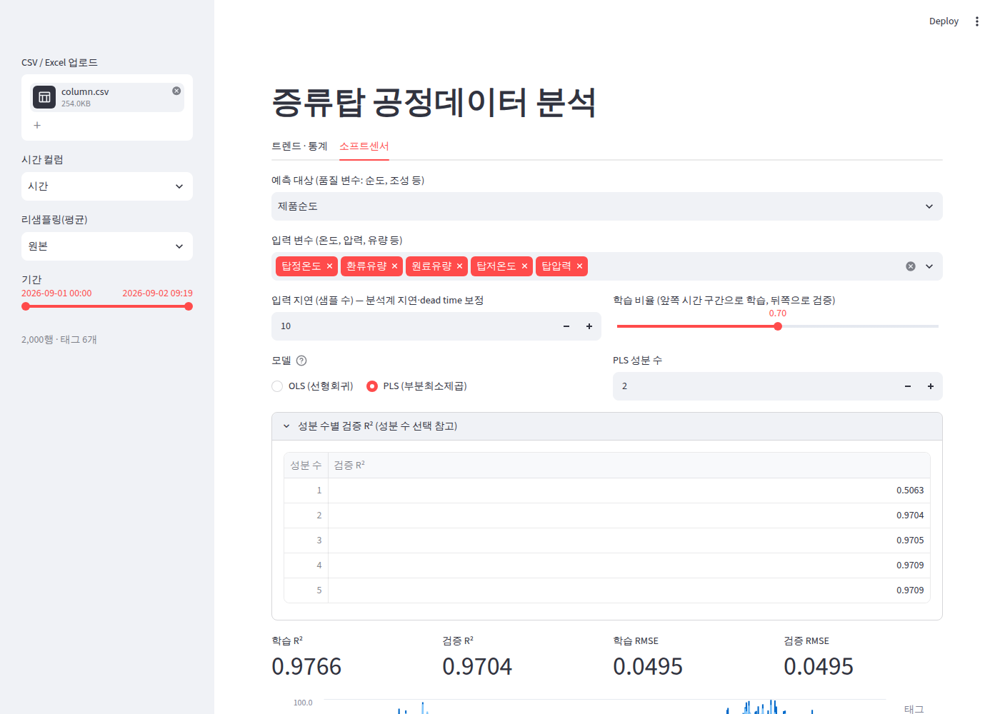

# 증류탑 공정데이터 분석 프로그램 사용 매뉴얼

DCS/PI 등에서 내보낸 증류탑 시계열 데이터(CSV/Excel)를 올려서

- **트렌드·통계**: 태그별 추이 그래프, 기초통계, 상관계수 확인
- **소프트센서**: 온도·압력·유량으로 제품 순도 같은 품질 변수를 예측하는 모델(OLS / PLS) 생성

을 할 수 있는 웹 대시보드입니다.

---

## 1. 설치 및 실행

Python 3.10 이상이 필요합니다.

```bash
pip install -r requirements.txt
streamlit run app.py
```

실행하면 브라우저가 자동으로 열립니다. 열리지 않으면 주소창에 `http://localhost:8501` 을 입력하세요.
종료는 터미널에서 `Ctrl + C`.


---

## 2. 데이터 준비

### 파일 형식

- **CSV** (`.csv`) 또는 **Excel** (`.xlsx`, 첫 번째 시트)
- 첫 행은 헤더(컬럼 이름)
- 시간 컬럼 1개 + 태그별 컬럼

```
시간,원료유량,환류유량,탑정온도,탑저온도,탑압력,제품순도
2026-09-01 00:00,50.02,30.11,78.05,110.1,1.201,99.02
2026-09-01 00:01,50.05,29.87,78.10,110.0,1.198,
2026-09-01 00:02,50.01,30.02,Bad,110.2,1.203,
...
```

### 자동으로 처리되는 것

| 상황 | 처리 |
|---|---|
| 한글 CSV 인코딩 (UTF-8 / CP949·EUC-KR) | 자동 인식 |
| `Bad`, `I/O Timeout`, `Shutdown` 등 숫자가 아닌 값 | 빈 값(결측)으로 처리 |
| 시간으로 해석할 수 없는 행 | 제외 |
| 시간 순서가 섞여 있음 | 시간순 정렬 |
| 숫자가 하나도 없는 컬럼 (설명, 단위 등) | 제외 |
| 분석 값(Lab/GC)처럼 드문드문 있는 품질 변수 | 값이 있는 시점만 모델 학습에 사용 |

> 파일 한 개의 최대 크기는 200MB입니다 (Streamlit 기본값).

---

## 3. 사이드바 설정 (공통)

| 항목 | 설명 |
|---|---|
| **CSV / Excel 업로드** | 분석할 파일을 끌어다 놓거나 클릭해서 선택 |
| **시간 컬럼** | 시간이 들어 있는 컬럼 선택 (기본: 첫 번째 컬럼) |
| **리샘플링(평균)** | `원본` / `1min` / `10min` / `1h` / `1D`. 선택한 간격으로 평균을 냅니다. 데이터가 크거나 노이즈가 심할 때 사용 |
| **기간** | 분석할 시작·끝 시각. 정기보수 구간, 트립 구간 등을 빼고 볼 때 사용 |

맨 아래에 현재 적용된 행 수와 태그 수가 표시됩니다.
사이드바 설정은 두 탭 모두에 적용됩니다.

---

## 4. 트렌드 · 통계 탭


1. **태그** 에서 보고 싶은 태그를 선택합니다 (기본: 앞쪽 4개).
2. 그래프
   - 마우스 휠: 확대/축소, 드래그: 이동, 더블클릭: 원래대로
   - 선에 마우스를 올리면 값이 표시됩니다.
3. **정규화(z-score)** 체크
   - 온도(80℃)와 압력(1.2 bar)처럼 단위·크기가 다른 태그는 한 그래프에서 작은 쪽이 평평한 선으로 보입니다.
   - 체크하면 각 태그를 (값 − 평균) / 표준편차로 바꿔서 **변동 패턴** 을 비교할 수 있습니다.
4. **기초통계**: 개수(count), 평균(mean), 표준편차(std), 최소/최대, 사분위수
   - count가 다른 태그보다 적으면 그만큼 결측(Bad 값 등)이 있다는 뜻입니다.
5. **상관계수**: −1 ~ 1
   - 1에 가까움: 같이 오르내림, −1에 가까움: 반대로 움직임, 0 근처: 관계 없음
   - 소프트센서 입력 변수를 고를 때 참고하세요. 예측 대상과 상관이 큰 태그가 후보입니다.

---

## 5. 소프트센서 탭



### 5.1 설정 항목

| 항목 | 설명 |
|---|---|
| **예측 대상** | 예측하려는 품질 변수 (제품 순도, 불순물 농도 등). 기본값은 마지막 컬럼 |
| **입력 변수** | 예측에 사용할 태그 (탑정/탑저 온도, 환류량, 원료량, 압력 등) |
| **입력 지연 (샘플 수)** | 입력 변수를 몇 샘플 뒤로 밀어서 예측 대상과 맞출지. 5.3 참고 |
| **학습 비율** | 앞쪽 시간 구간 몇 %로 모델을 만들고, 나머지 뒤쪽 구간으로 검증할지 (기본 70%) |
| **모델** | OLS (선형회귀) 또는 PLS (부분최소제곱). 5.4 참고 |
| **PLS 성분 수** | PLS 선택 시에만 표시. 5.5 참고 |

> 학습/검증을 **시간 순서로 나누는 이유**: 무작위로 섞으면 바로 옆 시점 데이터가 학습과 검증에 같이 들어가서 성능이 실제보다 좋게 나옵니다. 앞 구간으로 학습하고 뒤 구간을 맞히는 방식이 실제 운전에서 쓰는 상황과 같습니다.

### 5.2 결과 읽는 법

| 결과 | 의미 |
|---|---|
| **학습 R² / 검증 R²** | 1에 가까울수록 잘 맞음. 0이면 평균값을 찍는 수준. **검증 R²** 를 기준으로 판단하세요 |
| **학습 RMSE / 검증 RMSE** | 예측 오차의 크기 (예측 대상과 같은 단위). 분석계 정밀도와 비교해 보세요 |
| **실측 vs 예측 그래프** | 두 선이 얼마나 겹치는지. 검증 구간(경계 시각 이후)에서 벌어지면 모델이 새 운전조건을 못 따라간다는 뜻 |
| **학습/검증 경계** | 이 시각 이전은 학습, 이후는 검증 데이터 |
| **변수 영향도 (표준화 계수)** | 입력 변수를 1 표준편차 바꿨을 때 예측값이 얼마나 바뀌는지. 절댓값이 클수록 영향이 크고, 부호는 방향(+ 증가, − 감소) |

**판단 기준 예시**

- 학습 R² ≈ 검증 R², 둘 다 높음 → 좋은 모델
- 학습 R²는 높은데 검증 R²가 많이 낮음 → 과적합, 또는 검증 구간의 운전조건이 학습 구간과 다름. 입력 변수를 줄이거나 PLS 성분 수를 줄여 보세요
- 둘 다 낮음 → 중요한 입력 변수가 빠졌거나 지연이 맞지 않음

### 5.3 입력 지연 찾기

증류탑은 입력(환류량, 스팀량 등)이 바뀌어도 제품 조성은 몇 분~몇십 분 뒤에 변합니다. 온라인 분석계(GC)도 샘플링·분석 시간만큼 늦게 값이 나옵니다.

1. 지연을 `0`으로 두고 검증 R²를 확인합니다.
2. 지연 값을 조금씩 늘려 가며 검증 R²가 **가장 높아지는 값**을 찾습니다.
3. 지연 단위는 **샘플 수** 입니다. 1분 데이터에서 `10`은 10분, `10min` 리샘플링 후 `3`은 30분입니다.

> 예: 샘플 데이터에서는 지연 0 → 검증 R² 0.81, 지연 10 → 0.97

### 5.4 OLS와 PLS 중 무엇을 쓸까

| | OLS (선형회귀) | PLS (부분최소제곱) |
|---|---|---|
| 방식 | 입력 변수를 그대로 사용해 오차가 최소가 되는 직선을 찾음 | 입력 변수를 서로 독립인 몇 개의 **성분**으로 압축한 뒤 회귀 |
| 적합한 경우 | 입력 변수가 적고 서로 독립적일 때 | 입력 변수가 많거나 **서로 상관이 강할 때** (예: 3단·5단·7단 온도) |
| 주의 | 상관이 강한 변수가 같이 들어가면 계수가 크게 튀거나 부호가 뒤집힘 | 성분 수를 골라야 함 |

**트렌드·통계 탭의 상관계수에서 입력 변수끼리 0.9 이상**인 쌍이 있으면 PLS를 권장합니다.
PLS 성분 수를 입력 변수 개수와 같게 하면 OLS와 결과가 같습니다.

### 5.5 PLS 성분 수 정하기

**성분 수별 검증 R²** 를 펼치면 성분 수마다 검증 R²가 표시됩니다.

- 검증 R²가 **더 이상 크게 오르지 않는 가장 작은 성분 수**를 고르세요.
- 예: 1개 0.51 → 2개 0.970 → 3개 0.971 → 5개 0.971 이면 **2개** 가 적당합니다. 성분이 적을수록 새 운전조건에서 안정적입니다.

### 5.6 결과 내보내기

**예측 결과 CSV 다운로드** 를 누르면 시간별 `실측`, `예측`, `구분(학습/검증)` 이 저장됩니다.
Excel에서 바로 열어도 한글이 깨지지 않습니다.

---

## 6. 문제 해결

| 증상 | 원인 / 해결 |
|---|---|
| "시간으로 해석할 수 없거나 숫자 태그가 없습니다" | 사이드바에서 **시간 컬럼** 을 올바르게 선택했는지 확인. 시간 형식이 `2026-09-01 00:00` 처럼 되어 있는지 확인 |
| "결측 제거 후 데이터가 N행뿐이라…" | 예측 대상이나 입력 변수에 빈 값이 많음. 기간을 넓히거나, 결측이 많은 입력 변수를 빼거나, 지연 값을 줄이세요 |
| 그래프가 평평한 선으로 보임 | 크기가 다른 태그를 같이 보고 있음 → **정규화** 체크 |
| 화면이 느림 | 사이드바 **리샘플링** 으로 데이터 간격을 늘리거나 **기간** 을 좁히세요 |
| Excel 파일의 두 번째 시트를 쓰고 싶음 | 해당 시트를 별도 파일로 저장하거나 CSV로 내보내서 업로드 |
| `.xls` (구버전 Excel) 파일 | Excel에서 `.xlsx` 또는 `.csv` 로 다시 저장 후 업로드 |

---

## 7. 알아둘 점

- 모델은 **선형** 입니다. 운전 범위가 크게 달라지면(부하 변경, 원료 변경) 그 구간 데이터로 다시 학습하세요.
- 모델은 화면에서 계산만 하고 저장되지 않습니다. 계수는 **변수 영향도** 표와 **절편** 값을 기록해 두면 됩니다. 이때 계수는 **표준화된 입력** 기준이라, DCS에 그대로 옮기려면 원래 단위로 환산해야 합니다.
- 분석 결과는 참고용입니다. 실제 운전 판단 전에 공정 엔지니어가 검토하세요.
